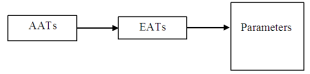

## Apparent and Equivalent Atom Types

An equivalence table (EQT) is used to reduce the number of atom types (and consequently the number of parameters). Apparent atom types (AATs) are mapped to equivalent atom types (EATs) to identify parameters in force field files. This mapping is done by using an equivalence table.

 
Energy terms in a force field are defined as functions of coordinates of one, two, three or four atoms, with each atom represented by an atom type. Because each atom type carries environmental information for other atoms in the same energy term, the required information for each atom type depends on the number of atoms in an energy term and the position of the atom in an energy term. The more atom types used in an energy term, the less specific the atom types.; For three-atom and four-atom energy terms, the atom type definitions of the central atoms are more specific than those of the peripheral atoms. 

EQTs are constructed during the process of parameterization, with more specific atom types used only when necessary. The most specific atom types are those defined for one-atom energy terms (nonbond), with two-atom (bond), three-atom (angle) and four-atom (dihedral) terms becoming less specific. The least specific atom types are those used for peripheral atoms in three-atom and four-atom energy terms. 

## Integrated Atom Types

When a force field is made by mixing two or more force fields, the atom types taken from original force fields are mapped to integrated atom types to maintain a short string length of atom types. The map is one-to-one mapping, does not have any impact to the usage of force field parameters. 