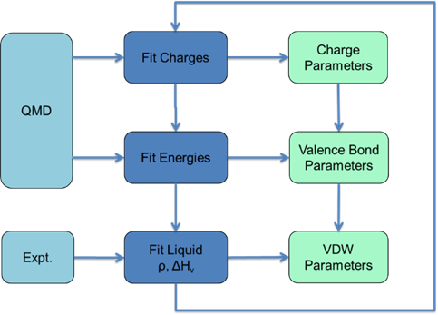

# General Procedure

force field parameters can be divided into three general parts: charge parameters (electrostatics), valence bond parameters, and van der Waals (VDW) parameters. The combination of electrostatics and VDW terms are also called non-valence or non-bond energies because they described interactions between atoms that are not directly bonded. Because all three parts are coupled, it difficult to fit them simultaneously. A practical method is to fit these three parts iteratively until all parameters converge, as illustrated in the following chart:
 
 
 
As shown in the figure, charge and valence terms are derived based on QM data, and VDW parameters are derived from experimental data. Data is calculated or obtained for a set of molecules called the training set. In the following sections, we will explain how to collect a training set, prepare QM and experimental data, and make initial parameters, as well as how to derive charge, valence and VDW parameters.
