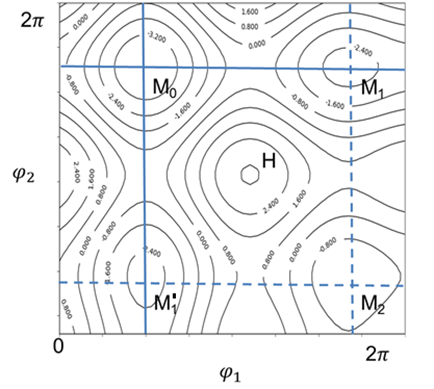

# Quantum Mechanics Data

It is critically important to prepare quality quantum mechanics data (QMD) for developing a force field. Generally speaking, if the fit itself is successful - which can be verified by checking the fit merits (squares of displacements, variances of parameters) - the quality of resulting force field is mostly determined by the quality of the underlying data. It is therefore very important to provide complete, quality data in order to develop a force field.
  
## DFT Method

- M06 is the default, which is slightly better than B3LPY
- A mixed Basis sets: 6-31+G(d,p) for elements of H-Kr and LanL2DZ for heavy elements [Gaussian document](https://gaussian.com/basissets/) is the default.

## Optimization [Draft]

Structure optimization is repeated in generating QMD. For any given initial structure, the first optimization may lead to a local minimum, which service as starting point for subsequent conformation scanning. During the scanning, if lower energy structure is found, the structure will be used to replace the previously obtained. In QMD file, there is only one fully optimized structure, ideally, it is the global minimum structure.

When optimization is done, the optimized atom coordinates will be used to build a new molecule. If the net charge from QM job is not zero, formal charge will be assigned to the new molecule. The newly built molecule will be compared against with the input molecule to confirm that the optimized structure is for the same molecule. This step will expose a situation when the optimized molecule is not the same as input, often caused by improperly built input structure. When this happens, the computation will stop and prompt the user to check the cause. 

## Sampling Conformational Energy Space

To derive force field parameters for a molecule using QM method, at least one optimized structure must be provided, and the calculations should include total energy, gradients, the Hessian matrix (the second derivatives of energy), and atomic charges. 

Different structures of a molecule in addition to the minimum energy structure can be included to sample potential energy surfaces. In most cases, the interested structures are conformational isomers, which can be generated by rotating flexible bonds. Although structures generated by distorting bond lengths and angles could also be included, it is not necessary in force field development because the anharmonic behavior is not significant under the conditions of classic simulations. Many force field types do not support the anharmonic terms. Even for force field type such as CFF that includes the anharmonic terms, those terms can be well estimated from the harmonic term (see TEAM type). Therefore, the distortion sampling usually does not include bond lengths and angles.

The conformers can be calculated by constrained optimization, in which one or more dihedral angles are fixed while all other internal coordinates are relaxed. The obtained potential energies are near minimum energy states, the force field parameters obtained by fitting the potential energies are more reliable.   

## TODO - need to be revised

- 1D and 2D sampling using Gaussian scan function
    - 1D is symmetry independent, only sample unique dihedral angle, identified by default atom types.
    - 2D refers to two adjacent dihedral angles (e.g. a1-a2-a3-a4 and a2-a3-a4-a5), if two dihedral angles are not adjacent, they combinations are not considered. The combinations are made from two 1-D unique dihedral angles in the orders of m and n, therefore, the total number of data points to be calculated is ${m \times n}$.  
    - Normally 1-D sampling is used, the among 1-Dihedral angles are represented by other energy terms in the force field. However, if the two adjacent dihedral angles are strongly correlated, 2-D scanning is necessary. A good example is OCCO (ethylene dioxide), a 2-D scanning can find many local minima and the global minimum.  

- OOP angle sampling is calculated as single point energy calculations.  Therefore, it is important to start the sampling from global minimum structure. 
    - The OOP angles refers to triangular pyramid structures by four atoms: A, B, C and D. Atom A it center connected with three side atoms. Three atoms B-A-C form a plan, and bond A-D form an out-of-plan (OOP) angle with the plane. 
    - The order of B, C, D is made by the following way,    
        - sort the three side atoms a1, a2, a3;
        - if two atoms are equal, move the heavy one to be D;
        - otherwise, follow the sorted order from heavy to light.
    - The sampling angles are made from optimized OOP angle, if it is close to zero, then sample both sides by 10 degrees. If it is not close to zero, then sample one point that is 10 degrees higher, and then sample points with reduced OOP angle until zero.  
    - Only symmetrically unique OOP angle is sampled. For example, NCCN only sample one OOP angle.

To sample the conformational space efficiently is not trivial for a molecule with multiple rotatable bonds. A systematical scan of entire surface quickly becomes unmanageable. For example, for a molecule with 3 rotatable bonds, if each rotation needs to calculate 10 points in corresponding dihedral angle, a total of 1000 minimization are required. One may use the random sampling to pick up certain number of points and then find the local minima by energy minimization. Another approach, called orthogonal sampling, may find not only the minimal energy points, but also the saddle points. In the orthogonal sampling, the rotatable bonds are scanned one after another, not simultaneously, from identified minimum energy points. Although the conformational space is not completely sampled, the data points will likely cover the important lower energy regions. As illustrated by the following figure of a 2-D energy surface. 

Starting from a minimum energy point M0, varying φ1 reaches minimum energy point M1 and varying φ2 reaches another minimum energy point M’1 (solid lines). Moreover, varying either φ1 from M’1 or φ2 from M1 both reaches M2 (dash lines). By doing so, the local minima and vicinity of saddle points are scanned, but not the high-energy region (H).
 
 
## Sampling Intermolecular Energy Curve 

The QM method can be used to probe intermolecular interactions by calculating structures and energies of molecular dimers. DFF supports this type of calculation and provides a method to generate dimer structures automatically. However, it must be noted that using QM methods to characterize weak VDW interactions is a challenging task. Even if calculations can be performed accurately with high levels of correlation and a complete basis set, results still represent interactions between two molecules in a vacuum. To get accurate van der Waals parameters for molecules in condensed phases, condensed phase properties must be used to optimize the force field.

## QMD FILE

The QM calculations can be done by using any quantum mechanics software package. In order to support different software packages, a standardized file format is designed for storage of QM data. This file format is the QMD file format and uses the extension *.qmd. QMD files are written in simple text file format, and is the only interface between QM calculations and DFF software.  

Each QMD file corresponds to one molecule, must contain one optimized structure, and may or may not contain conformational isomers. The optimized structure, contains essential data: energy, first and second derivatives of energy, atomic charges (Mulliken or ESP), and electrostatic multiple moments. Conformational isomers, if included, do not require second derivatives. Calculation protocols, methods and basis sets are embedded in the QMD file. The QMD file also contains molecular topology information (connectivity, formal charges, atom types, etc.) which are not required for input, but are generated and used by DFF for parameterization. 

There are no particular requirements on the QM methods (HF, DFT, MP2, etc.) and the basis sets used in calculations. Since the ultimate criterion is agreement with experimental data, any QM method that can produce good agreement with experimental data can be used to generate QMD. The DFT method with B3LYP functionality and a modest 6-31G(d) basis set is adequate for describing structural and energetic properties of most organic molecules,48 and is used as the default QM calculation protocol in DFF. 

Before QMD data is used for parameterization, it is a good practice to check data validity. Usually this can be done by comparing relative energies of different structural isomers in a QMD file. The lowest relative energy should correspond to the global minimum with a Hessian matrix calculated. Relative energies should not be too large, and charge parameters should be present in the data set.
