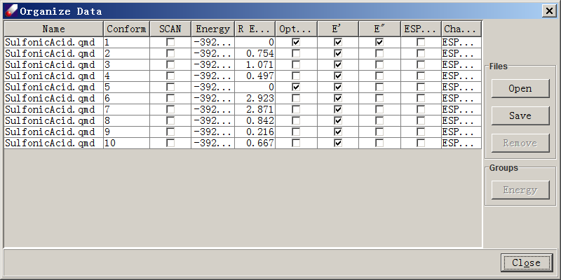

# QMD MENU - COMPUTE AND ORGANIZE QUANTUM MECHANICS DATA

## QM CALCULATIONS

**Z-Matrix** opens a Make Z-matrix dialog for Gaussian calculations. With this dialog open, Left-Click to select a Starting atom and click Make to make a new Z-matrix. The Z-matrix can then be edited as necessary. Click OK to save it.

**Compute** opens an interface to prepare input files for QM calculations. If Gaussian is installed on the same computer, it can be launched directly from the interface. 

The top section lists the models selected. "Computation" provides common options used in the preparation of parameterization data.  The Job name will used to identify this background job. The Use Z-Matrix option is useful for dealing with difficult structures, and Check Z-Matrix can be used to modify the Z-matrix. Scan Dihedral can be used to calculate a minimized conformational energy profile. Set specifies which dihedral angle will be rotated. With this option, a series of minimization jobs will be launched. Note that this option should be used with the minimized structure. 

In the Options section, computation variables including method, basis set, total charge, spin multiplicity, CPU number (only for shared computers), maximum CPU time allowed, and memory limit can be specified. If the molecule to be calculated is an ion, the charge and spin multiplicity will be assigned accordingly.  

In the Job section, computation logistics are specified. Make input files only generates input files without running calculations, while Run background job starts the calculation and loads results onto the same computer. If a background job is begun, there are three options for results. Append data to a QMD file converts and saves all calculated data into one QMD file. Make a QMD file for each calculation makes a QMD file for each model calculated. Do not generate QMD file does not convert the QM output to QMD. As default, original QM output files are saved. Package is used to set the path to the Gaussian executable, which can be located using Browse. 

## QUANTUM MECHANICS DATA (QMD) 

**Organize QMD** starts an Organize Data dialog allowing the user to view, manage, and output QM files (.qmd). From version 7 onward, DFF uses the .qmd file format for fitting forcefield parameters and does not directly use GAUSSIAN output files. Organize QMD can also be used to examine and organize QM data.

In the Organize Data dialog, data for each structure is listed in spreadsheet form. Open is used to load GAUSSIAN or DFF output files in .qmd format. Files of the .bdf format can also be loaded. Files already in the Project Navigator can be selected and directly loaded by clicking QMD Organizer. Name displays the file name of each structure. Note that each file may contain multiple conformers, which are labeled in the Conform column. Energy lists the absolute energy and R Energy lists the relative energy. Optimized indicates whether a structure is fully optimized, and E' , E"  are first and second derivatives. ESP Field indicates whether potential values have been calculated. Charges lists atomic charges available in the QM data files. In order to derive parameters, at least one conformer must be optimized with E', E" and one set of charges calculated. Selecting one or more lines activates several command buttons in this dialog. Save writes .qmd files, Remove deletes selected line from the list, and Energy calculates and displays relative energies.
