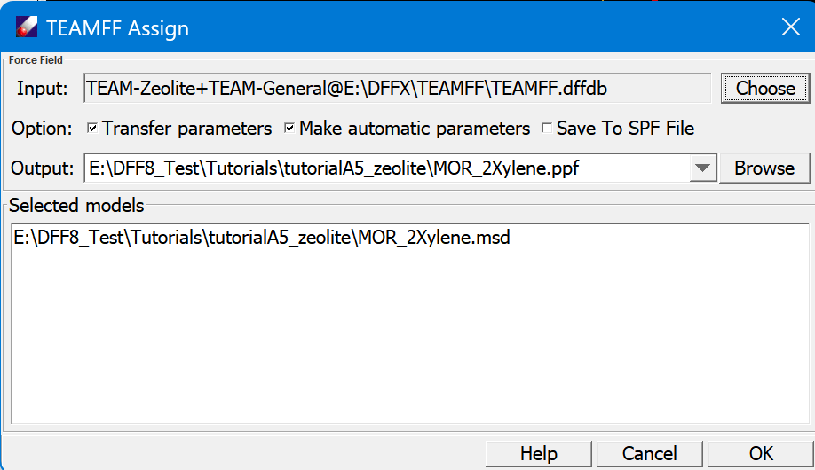

## TEAMFF Assign Dialog

- **Input** lists the force fields to be called in the order of searching sequency.

- **Option** handles how parameters are treated in case explicit parameters are not found when all searches are exhausted. **Transfer parameters** will use the most closely matched atom types to get parameters, **Make automatic parameters** will supplement parameters by automatic parameters. **SPF file** combines MSD and PPF, otherwise, the MSD is linked with PPF.

- **Output** is the output ppf file to be saved.

- **Selected models** lists the models to be called. After the assignment, the models will be updated with new atom types and associated with the result ppf file.