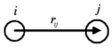
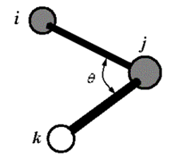
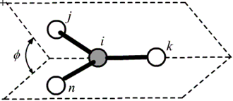
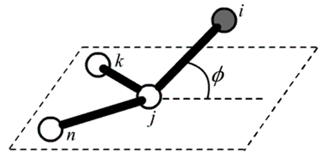

# Force Field Functions

## Bonded Functions

Bonded terms are defined by atoms that are directly bonded - bond lengths, bond angles, dihedral angles, improper dihedral angles and out-of-plane angles. These terms are also referred as "Valence  terms".

### Bond Functions
Bond is defined by two atoms:

 

|ID    |Function   | Parameters 
|------|-----------|------------
|BHARM |$k_2(r-r^o)^2$ |$r^o$, $k_2$ 
|BQUAR |$\sum_{n=2}^4 k_{n}(r-r^o)^n$ |$r^o, k_2,k_3,k_4$
|BDQUA |$k_{2}(r-r^o)^2 [1 - 2(r-r^o ) + \frac{7}{3}(r-r^o)^2]$ |$r^o, k_{2}$

### Bond Angle Functions
Bond angle is defined as by three atoms i-j-k:

 

|ID    |Function   | Parameters 
|------|-----------|------------
|AHARM	|$K_θ(θ-θ^o)^2$   |$θ^o, K_b $	
|AQUAR	|$\sum_{n=2}^4 k_n(θ-θ^o)^n$|$θ^o, k_2, k_3, k_4$
|ADQUA\*|$k_2(θ-θ^o)^2 [1 + A(θ-θ^o) + B(θ-θ^o)^2]$|$θ^o, k_2$
|ACOSH	|$k(cosθ-cosθ^o)^2$|$θ^o, k_b$

\*  $A = \frac{2(\pi-2\theta^o)}{3\times \theta^o(\pi-\theta^o)}, B = -\frac{1}{2\times\theta^o(\pi-\theta^o)}$ if $\theta^o\neq0$ or $\pi$; else $A = B = 0.$

### Dihedral Angle Function

dihedral angle is defined by atom i-j-k-l, where j-k is the center bond.

 

|ID    |Function   | Parameters 
|------|-----------|------------
|TBCOS\* |$\sum_{n=1}^6 k_n[1+cos(nφ-\phi^o)]  $|$ k_n   $ 
|TCOSM |$\sum_{n=1}^3 K_n[1-cosn(φ-φ^o)]  $|$ φ_o, k_n   $ 
|TCOSP |$\sum_{n=1}^3 K_n[1+cos(nφ-φ^o)]  $|$ φ_o, k_n   $ 
|TCS3M |$\sum_{n=1}^3 K_n(1-cosnφ)  $|$ n, k_n           $  

\*$\phi^o$ is fixed, = 0 for odd n, =π for even n.

### Improper Dihedral Angle Function
The improper dihedral angle is measured as the dihedral 
angle of two surfaces made by bond pairs of j-i/i-k and 
n-i/i-k respectively.

 

|ID    |Function   | Parameters 
|------|-----------|------------
|IHARM |$K_\chi(\chi-\chi_o)^2$   |$ \chi_o$ , $k$ 
|IBCOS |$k[1+cos(n\chi-\chi^o)]$|$\chi_o$ , $k$ 

### Out-of-Plane Angle 

 

|ID    |Function   | Parameters 
|------|-----------|------------
|OHARM |$K_\chi(\chi-\chi_o)^2$      |$ \chi_o$ , $k$ 
|OBCOS |$k[cos(\chi)-cos(\chi^o)]^2$ |$\chi_o$ , $k$ 

## Cross-coupling Functions 

The cross coupling terms are used in CFF and TEAM force field types. These functions describe the coupling of two or three bonded terms.
The reference values of bond ($r^o$), angle ($\theta^o$) and dihedral angle ($\phi^o$) are the same as those used in the bonded terms.

|ID    |Description| Function   | Par
|------|-----------|------------ |-----
|C_B_B |Two bonds with a common atom|$k(r_1-r_1^o)(r_2-r_2^o)$    | $k$ 
|C_B_A |A bond angle with one of the two bonds forming the angle|$k(r-r^o)(\theta-\theta^o)$  | $k$ 
|C_A_A |Two angles share a common bond|$k(\theta_1-\theta_1^o)(\theta_2-\theta_2^o)$  | $k$ 
|C_B_T |A dihedral angle with its center bond|$(r-r^o)\sum_{n=1}^3  k_ncos (n\phi)$  | $k_1$  $k_2$  $k_3$ 
|C_A_T |A dihedral angle with one of its two angles|$(\theta-\theta^o)\sum_{n=1}^3  k_ncos (n\phi)$  | $k_1$  $k_2$  $k_3$ 
|C_BBT |A dihedral angle with of one of its two side bonds|$(r_1-r_1^o)\sum_{n=1}^3  k_ncos (n\phi)$  | $k_1$  $k_2$  $k_3$ 
|C_AAT |A dihedral angle with of its two side angles|$k(\theta_1-\theta_1^o)(\theta_2-\theta_2^o)cos (\phi)$  | $k$ 
|C_B2B |Two side bonds in a dihedral angle |$k(r_1-r_1^o)(r_2-r_2^o)$ | $k$ 

## Nonbonded Functions

### Electrostatic Function

The electrostatic interactions are interactions between atom i and j that are either in different molecules, or in one molecule but separated by at least three consecutive bonds (1 - 4 and beyond). The energy is given by Columbic function:

$$E_{ij} = \frac{1}{4πε_0}\frac{q_i q_j}{r_{ij}}$$ 

charges $q_i, q_j$ are calculated as:

$$ q_i = q_i^o + \sum_k \delta_{i,k}$$

by using two parameters: 

|ID    |Description| Par
|------|-----------|------------
| ATC  | Atom type charge | $q_i^o$
| BINC  | Bond increment charge | $\delta_{i, k}$

### Lennard Jones Function

LJ-12-6 is commonly used.

$$
E_{ij} = \epsilon_{ij}\left[(\frac{r_{ij}^o}{r_{ij}})^{12} - (\frac{r_{ij}^o}{r_{ij}})^{6}\right]  
$$

The combination rule is 
$$
\epsilon_{ij} = \sqrt{\epsilon_i \epsilon_i}  
$$ 

$$
r_{ij}^o = \frac{r_i^o + r_j^o}{2}  
$$

Therefore, the energy is calculated using two parameters for each atom
|ID    |Description| Par
|-------|-----------|------------
| N12-6 | LJ-12-6 parameters | $r_i^o$,  $\epsilon_i^o$

LJ-9-6 is used by CFF:

$$
E_{ij} = \epsilon_{ij}\left[(\frac{r_{ij}^o}{2r_{ij}})^{9} - 3 (\frac{r_{ij}^o}{r_{ij}})^{6}\right]  
$$

where the combination rule is
$$
\epsilon_{ij} = 2\sqrt{\epsilon_i \epsilon_i}\frac{(r_i^o)^3\times(r_j^o)^3}{(r_i^o)^6 + (r_j^o)^6}
$$

$$
r_{ij}^o = \left[\frac{(r_i^o)^6 + (r_j^o)^6}{2}\right]^{1/6}
$$

Therefore, the energy is calculated using two parameters for each atom
|ID    |Description| Par
|-------|-----------|------------
| N_9_6 | LJ-9-6 parameters | $r_i^o$,  $\epsilon_i^o$

## Other Function

General LJ-N-M: (n>m)

$$
E_{ij} = \epsilon_{ij} \frac{\epsilon_{ij}}{n-m} \left[m(\frac{r_{ij}^o}{r_{ij}})^{n} - n(\frac{r_{ij}^o}{r_{ij}})^{m}\right]  
$$

The combination rule is 
$$
\epsilon_{ij} = \sqrt{\epsilon_i \epsilon_i}  
$$ 

$$
r_{ij}^o = \frac{r_i^o + r_j^o}{2}  
$$

Buckingham
$$
E_{ij} = A_{ij}exp\biggl(-\frac{r_{ij}}{\rho_{ij}}\biggr) - \frac{C_{ij}}{r_{ij}^6}
$$

$$
A_{ij} = \sqrt{A_i A_j}; C_{ij}=\sqrt{C_i C_j}; \rho_{ij} = \frac{1}{2}(\rho_i + \rho_j)
$$

Morse function (BMORS):
$$
E_{ij} = \epsilon_{ij}\biggl[\biggl(1-exp^{-\alpha(r - r^o)}\biggr)^2 - 1 \biggr]
$$		  

$$
\epsilon_{ij} = \sqrt{\epsilon_i \epsilon_j}
; \alpha_{ij} = \sqrt{\alpha_i \alpha_j}; 
r_{ij}^o = \frac{1}{2}(r_i^o + r_j^o)
$$

## Functions and Parameters

The above function in different force field types are shown as examples in the following table. 

|FFType|Function ID | Atom types      |Parameters
|------|------|----------------------------|-----------------
|All   |ATC	  |o_1-/2                      | -0.5
|　	   |BINC	  |c_4,   o_1              	   | 0.2360
|　	   |　		　|                            |
|TEAM  |BDQUA  |c_2,   c_2              	|　
|　	   |ADQUA	|c_2,   c_2,   c_4       	   | 179.9511,    53.8431
|　	   |TBCOS	|c_3,   c_3,   c_4,   h_1	   | 1, -0.1978,  2*,  1.0728,  3*, -0.0947
|　	   |TBCOS	|c_4,   c_3,   c_3,   c_4	   | 2*,  5.4661                             
|　	   |OHARM	|c_3a,  c_3o,   c_4,   o_1	 | 0.0000,    44.0651                   
|　	   |N12_6	|c_3                     	   | 3.9800,     0.0760                   
|　	   |C_B_B	|c_2,   c_2,   c_4       	   | 8.6266
|　	   |C_B_A	|c_3,   c_4,   o_2       	   | 51.9669                                 
|　	   |　	　	|　                          |
|CFF   |	BQUAR	|c_2,   c_2              	   |  1.2107,  1212.6459, -2425.2919,   2829.5072
|　	   |AQUAR	|c_2,   c_2,   c_4       	   |  179.8087, 53.8431, -10741.8351, -2569.8855
|　	   |TCS3M	|c_2,   c_2,   c_4,   c_4	   |  0.1000,     -0.2500*,     0.1200
|　	   |OHARM	|c_3,   c_3,   c_4,   c_4	   |  0.0000*,     2.3488*
|　	   |N_9_6	|c_2                     	   | 3.9015*,     0.0819*
|　	   |C_B_B	|c_2,   c_2,   c_4       	   | -4.6381
|　	   |C_B_A	|c_34,  c_44,   h_1          | 	 21.4453*
|　	   |　	　	|　                          |
|AMBER |BHARM   |c_2,   c_2              	|1.2057*,  1276.7505*
|　	   |AHARM	|c_2,   c_2,   c_4       	   | 179.9975*,    21.7689*
|　	   |TCOSP	|c_3,   c_3,  c_3a,  c_3a	   | 180.0*,     0.9349*,  2*,   0.0*,     0.0968*,  3*
|　	   |IBCOS	|c_3,  c_4o,   c_3,   h_1	   | 180.0000*,     0.0000 ,     2.0000*
|　	   |N12_6	|CC2H2                       |  	3.9300*,     0.0660*
|　	   |　	　	|　                          | 
|CHARMM |BHARM|	c_2,   c_2             | 	1.2057*,  1276.7505*
|　	   |AHARM	|c_2,   c_2,   c_4       	   |  179.9975*,    21.7689*
|　	   |TCOSP	|c_3,   c_3,  c_3a,  c_3a	   |  180.0*,     0.9349*,  2*,   0.0*,     0.0968*,  3*
|　	   |IHARM	|c_34,  c_34,  c_44,   h_1   |  	0.0000*,    73.6481*
|　	   |N12_6	|n_3                     	   |  3.6930*,     0.1450*
|　	   |V14LJ	|c_2                     	   |  3.8250*,     0.0910*
|　	   |　	　	|　                          |  
|DREIDING |	N12_6|	c_4                  |            	3.9300*,     0.0660*
|　	   |BHARM	|c_4,   c_4                  |	1.5283 ,   213.6099 
|　	   |ACOSH	|c_4,   c_4,   h_1           |	107.1210 ,    54.6774 
|　	   |TCOSM	|h_1,   c_4,   c_4,   h_1    |	0.0000*,    -0.1405 ,     3.0000*
|　	   |OCOSH	|c_3,   n_3,   c_4,  h_1p    |	0.0000*,     10.0000*
