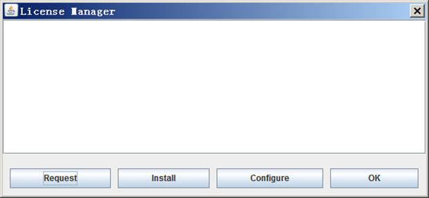
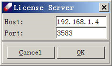

# Licensing

DFF requires license to run. The license is node locked, which means it only works on the designated computer identified by its MAC addresses. However, you can use DFF either on the same computer as default, or on different computers by using the floating license mechanism. 

## Local License

To use the local mode is straightforward. After DFF is installed, get an authorized license file following the instructions as you run DFF at the first time. When the license file is received, save it as \<dff-root>\License\License.txt. By default, DFF will be running using the local license mechanism.

## Floating License
To use the floating mode, the computer that has license installed is called license server, and the computers that access the license server is called license clients. The license server must be set up first, and the client computers should have DFF installed and configured to use the license server. 

## License Manager
There is an interface that can be used to configure license, either as a local mode or floating mode.
When DFF is started, if a license is not found, an message will appear, close the error message, the "License Manager" dialog will appear:


 
This dialog can also be opened by using Help→License command from DFF user interface. 

There are four command buttons on this dialog. 

**Request** is used to generate a license request file. Click this button and follow the instructions to generate a license request form, and send this form to DFF distributor to obtain a license file. 

**Install** is used to install the license file. After you have received a license file, click this button to allocate the license file and install it, which copies the license file to \<dff-root>/License/License.txt. 

**Configure** is used to set up how to access the license. The default values are "localhost" and "null" which sets the local license. To use floating license, enter the IP address and port number of the license server. For example, 



The port number is defaulted to 3583, which can be set differently when you set up the license server.

**OK** to close this dialog.

## License Server

If DFF is fully installed on the server computer, the computer can be used as both client and server. If the licensed computer is used as a license server only, only two files are required:

1)	The executable: \<dff-root>/bin64x/dfflsv.exe
2)	The license file: \<dff-root>/License/License.txt

Note that the license file must be authorized to the server computer.

The simplest way to start the server is to run the server program from command line, on Linux it may be:

```sh
$dfflsv.exe start &
```

which puts the program running in the background. The server can be started  automatically on Windows or Linux platforms. Refer to the system guidance for instructions on how to set up a server running.

Once the server is running, the license can be obtained from client computers. This is done by the following steps. First, install DFF on the client computer. Second, find and open `<dff.root>/License/License.ini` with any editor, set the IP address and port number of the license server. Assume the server's IP address is `192.168.86.75` with the default port `3583`, the `License.ini` file should be: 
   ```sh
   $HOST=192.168.86.75
   $PORT=3583
   ```
Then test the connection, use the following command from command line:
```sh
$dfflsv.exe test 192.168.86.74 3583
``` 
If the test fails, find out the cause and fix the problem. If the test succeeds, start DFF, which will connect the server to get a license.  

Each client is registered on the server. The number of DFF clients allowed is limited by the number of license. If the client is more than the number of license, an error message such as "Exceeded license number" will be prompt.

To check how many clients are registered with the server, using 
```sh
$dfflsv.exe status 192.168.86.74 3583
``` 
on client computers.

To add more clients, contact DFF distributors. To replace the registered clients, reset the registration using 
```sh
$dfflsv.exe reset
``` 
command.


## Options of dfflsv.exe 

This program can be used on server or client, depending on tasks.

*The square brackets indicate required parameters, the angle brackets indicate optional parameters.*

**On both client and server**

`dfflsv.exe help` - to show the options as explained below

`dfflsv.exe request [filename]` - to make and save a license request file.

`dfflsv.exe install [filename]` - to install the license file.

`dfflsv.exe getmac [filename]` - to get and save the MAC address in a file.

`dfflsv.exe test <host <port>>` - to test the connection to the server.

`dfflsv.exe status <host <port>>` - to list the license information.

`dfflsv.exe reset <host <port>>` - to clear the list of computers registered.

**On Server Only**

`dfflsv.exe start <port>` - to start a server with optional port (the default port number is 3583).

`dfflsv.exe stop <port>` - to stop the server, the port must be the same as start. 
 