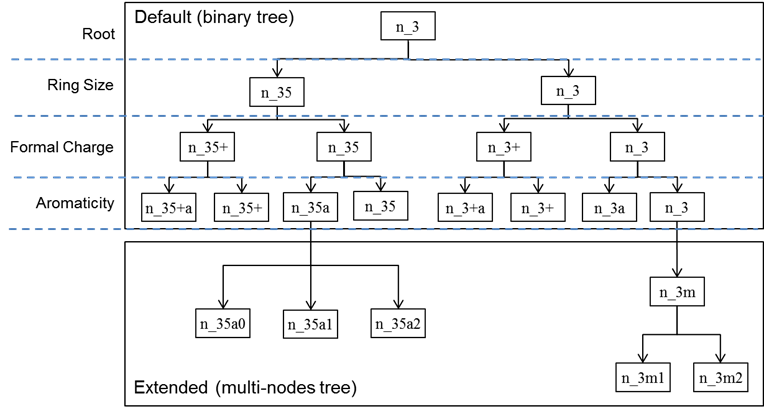

# Typing Rules

In DFF, atom types are assigned using typing rules. Three types of typing rules are implemented: Default, Script Extended Default and Scripted.

## Default Typing Rule

A default definition starts with a three-character root type in which the first two characters are reserved for a given atom's element symbol. If the element symbol is a single character, it is followed by an underscore. The third character is an integer that corresponds to the coordination number or the number of chemical bonds connected to the given atom. For example, n_3 represents a nitrogen atom with three chemical bonds. 

From the root type, a binary tree data structure is used to classify atom types in three levels:

1) Small ring size. If an atom is in a small ring (<6), the ring size is assigned. Therefore, an integer at the fourth character is a flag indicating the atom is in a small ring (e.g., n_35).

2) Formal Charge. If a formal charge is assigned to an atom, it is flagged by a sign (+ or –) followed by an integer (1 is omitted) or a character representing a fractional formal charge:
 
`d:Double(1/2)` 
`t:Triple(1/3)`  
`q:Quadruple(1/4)` 
`p:Pentuple(1/5)` 
`h:Hextuple (1/6)` 

3) Aromaticity. If an atom is in an aromatic ring, the reserved character “a” is appended.

For example, the atom type `c_35+pa` represents a carbon atom with three bonds in a five-member aromatic ring bearing a +1/5 formal charge.

The default definition provides the most essential information for an atom and has the following properties: 
1) the definition is complete; that is, any atom in any environment has an assigned atom type; 
2) each atom type is uniquely defined because only two child nodes are present at each node of the tree, and the choices are mutually exclusive; and 
3) the atom types are defined inheritably, that is, each atom subtype has only one parent atom type, and each atom subtype represents a subset of the chemical space represented by the parent atom type.

## Extended Default

In order to improve the level of description accuracy, Extended Default definition is implemented by adding more specific definitions using scripts. This forms the hierarchical atom type (HAT) scheme. [^1]

The following Figure illustrates the hierarchy of this typing scheme using a nitrogen atom as an example.

The extended definition starts from the Default definition. The attributes of neighboring atoms are then collected, and the search for neighbors can be nested. A multi-node tree data structure is used for extended definitions because the number of attributes is sufficiently large to differentiate atom types at a given level. An extended definition is specified by a set of scripts, which can be prepared using a text editor. For example, the following script defines a given amide nitrogen with two hydrogen atoms as n_3mh2, which is extended from the default atom type n_3:

`Define n_3m2h`  
`N[–*] [–H] [–C[=O]]`  
`atom 1: co=3, ar=no, rs>5, fc=0`  
`atom 2: co=?, elem = C, Si`  
`atom 3: co=?`  
`atom 4: co=3`  
`atom 5: co=1`  
`End`  

In this example, the first line is the atom type. The second line defines the topological substructure of the atom type to be defined. The substructure is defined using element symbols and bond orders. Element symbols can be a wild card symbol (* or ?). Bond orders are defined as single, double, partial double, triple and/or any bond order. In this example, the atom element (N) maps out the connectivity for the amide nitrogen atom, which has three single bonds: [–*], [–H], and [–C[=O]]. Brackets indicate substructures that can be nested. From lines 3 to 7, attributes for each atom in line 2 are provided in order of appearance. The coordination number (co) must be listed, but “?” indicates that the coordination number is ignored. Other characters include aromaticity (ar), ring size (rs), and formal charge (fc).

The same exclusive and inheritable properties of default definitions are implemented for extended definitions. Each child node has only one parent node, and sibling nodes are exclusively defined. The software tests the following two conditions to enforce exclusive and inheritable properties: 
- each atom type must represent a subset of the chemical space that its parent atom type represents, and 
- the chemical spaces represented by sibling atom types must not overlap.

Extended definitions are prepared as a definition file named \<filename\>.ext. For each extended definition for an atom type, a block of scripts as in the above example should be included. A complete description of the definition file format (.ext) is given in Chapter 6 of this document. This file must be placed in the \<dff-root\>/data folder. 

## Scripted

Scripts can be used to prepare a set of definitions without extending the default definitions. This definition is completely flexible, it does not rely on any predefined rules, can be defined at any level of sophistication. The definition is written as scripts that uses molecular topological information and atomic properties. The definition is particularly useful when importing a force field. The extension name for a Free Definition file is *.def.

