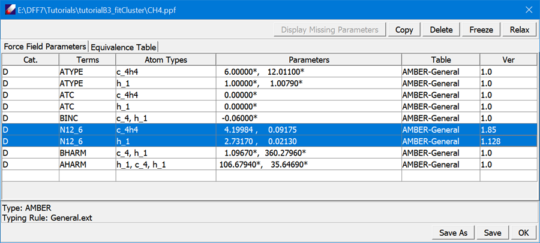
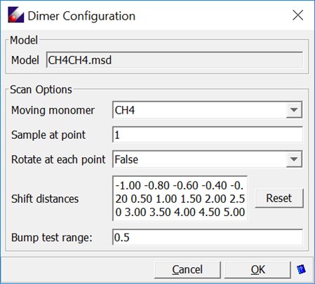
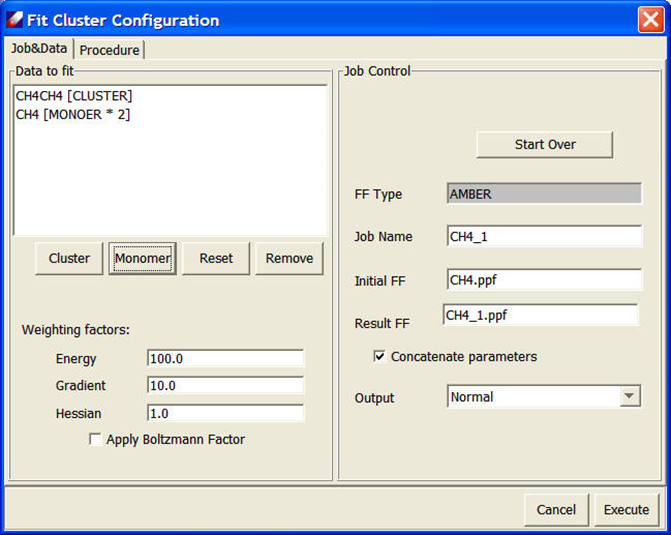
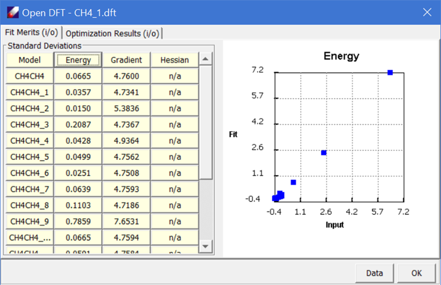

# Fitting a Molecular Dimer

In this tutorial, we will learn how to fit QM data of a molecular dimer to determine VDW parameters, demonstrated by methane molecules. To fit a VDW dimer, three models are required: dimer and two monomers. The two monomers may be the same as shown in this example. In practice, valence parameters should be determined before the VDW parameters to be adjusted. In this tutorial we will checkout parameters from TEAMFF.

The initial parameter PPF file and QMD files for methane monomers and dimer can be obtained following the steps below. For convenience, these files have been prepared and provided in the “tutorialB3_fitCluster” directory.

## Preparing Force Field

1.	Start DFF and open the project of "Tutorials.dpf". In the “tutorialB3_fitCluster” folder, double-click "CH4.msd" and "CH4CH4.msd" to open the molecular models. 

2.	Select both models in Project Navigator and use **TEAMFF/Checkout** command to get a PPF file for methane from “AMBER-General” force field table. The result PPF file will be loaded to the main screen. All parameters are fix indicated by the asterisk (*) sign. Select the “N12_6” parameters and click Relax button in the force field spreadsheet, the VDW parameters are relaxed. Click **Save** to save the changes, and then **OK** to close the window.
 

## Preparing QMD

3.	Click **QM Data/Compute** command to optimize and calculated Hessians for both models at MP2/6-311++G (2d,2p) level of theory. After the jobs are finished, make a new MSD model file by selecting the Gaussian output file, CH4CH4.log, and tight-click “Create MSD” command in Project Navigator.

4.	Double-click “CH4CH4.msd” in the Project Navigator to open it. Then select **QM Data/Dimer Configurations** to open the following dialog:
 

Leave all options as given, click **OK** to generate models in a sub-folder.

*This dialog sets the sampling points by shifting and optionally rotating one monomer relative to another. The shift distances in Angstroms are listed as the “Shift distance”. The values can be manually edited. At each point, the number of random rotations can be changed. This provides a way to sample the intermolecular interactions much more thoroughly. However, limited by the simple functional forms in common force field, fitting the potential energy surfaces might not be satisfactory.*

5.	Compute QM data at the same level of theory, MP2/6-311++G (2d,2p), for each of the sampling configurations (There should be 15 sampling points). Select all generated sampling models from the Project Navigator and click **QM Data/Compute**, set the Computation Type to “GRAIENT” and carry out the calculations. 

6.	When all Gaussian jobs are done, make two QMD files: “CH4.QMD” from the optimized with Hessian calculated CH4.log and “CH4CH4.qmd” from the optimized-hessian and all sampling Gaussian output files. This can be done by using QMD → Organize QMD command to open a new QMD dialog, and then use the Add button to browse and load the Gaussian output files. 

## Fit VDW Dimer

7.	Select both “CH4CH4.qmd” and “CH4CH4.qmd” models, which are associated with their MSD files, the MSD files are associated with the PPF file, Open “CH4.ppf” to list the parameters in Forcefield Editor spreadsheet. Make sure the N12_6 parameters are relaxed (without the asterisk * mark). 

8.	Use **Parameter/Fit VDW Dimer** to open "Fit Cluster Configuration" dialog. Both models are listed in the “Data to fit” list. We need to identify which one is cluster, which ones are monomers. Select “CH4CH4.QMD” and click Cluster, select “CH4.QMD” and click Monomer, twice. In the end, the dialog looks like:

Keep other parameters unchanged and click Execute to start fitting. When the job is done, a validation panel will appear:

It should be noted that the fit of isolated molecular dimer is only useful for describing intermolecular interaction in gas phase. For molecules in condensed phases, the VDW parameters should be optimized using the simulation data as shown in next tutorial.

