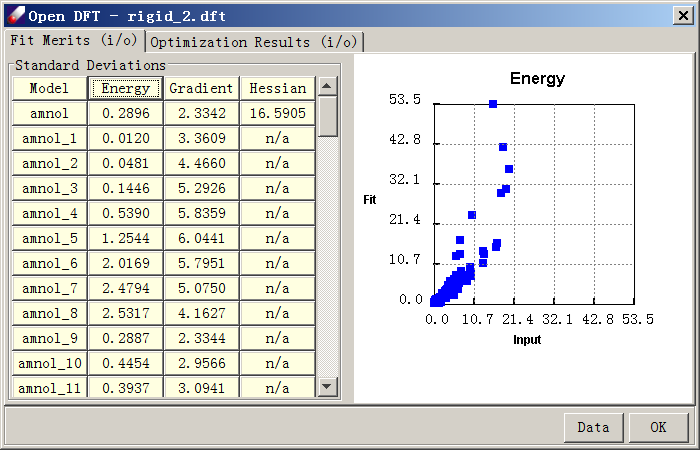
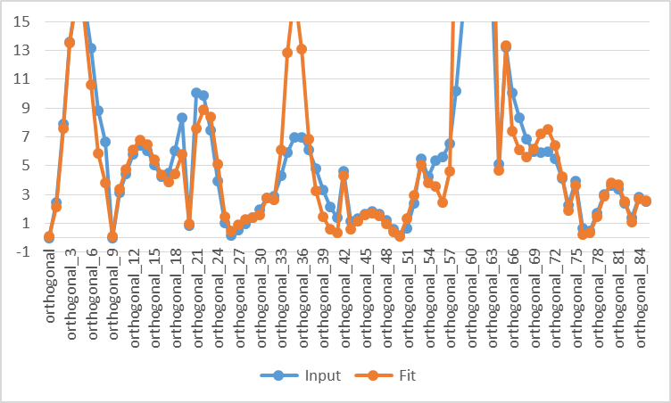
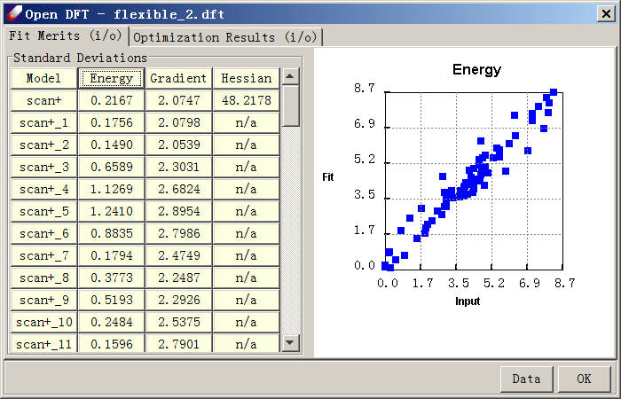
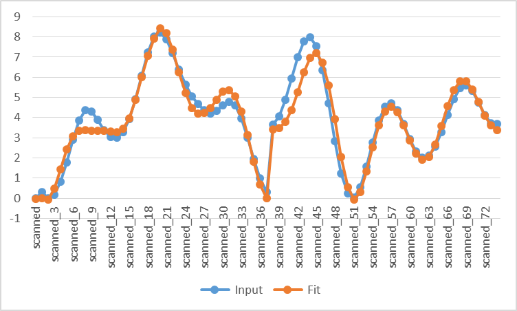

# Fitting Parameters if a Flexible Molecule

In this lesson we will learn how to fit a force field of 2-methylamino-ethanol (C3H9NO), a molecule with several rotatable bonds. Fitting flexible molecules is more difficult than fitting a rigid molecule. We will compare two sampling strategies and demonstrate the impact of different samplings on the quality of developed force field. The first is rigid sampling, in which all internal coordinates are fixed at selected values, as we used in the previous lesson. The second sampling is flexible; we sample the minimized energy curves along selected internal coordinates. For convenience, pre-calculated QMD files are included in the “tutorialB2_fitAmnol” folder.

## Rigid Sampling 

1.	Start DFF and open the "Tutorials" project. Open the “TutorialB2_fitAmnol” folder. Double-click on the C3H9NO.msd model in Project Navigator. Click **QM Data/Conformer** to open a dialog of sampling. The amino group is not planar, therefore, we shall sample the out-off-plane (OOP) angle as well. Select “Fixed interval” for “OOPA”. Leave all other parameters as default, then click on OK to launch the job. A total of 85 conformational isomers will be generated. 

2.	Run single point energy and gradient calculations for these structures using the B3LYP/6-31G* protocol. When the calculations are done, combine all data including the fully optimized structure with Hessian calculated (86 data in total) into one QMD file, which is named “rigid.qmd” in this Tutorial. Open “rigid.qmd”, select all entries and click on the “Energy” button to see the relative energy. The highest value is about 20 kcal/mol. 

3.	Fit the QMD file using the procedure explained in the last tutorial. Since some of the conformers are in high conformational energy, select “Apply Boltzmann Factor” in the Job & Data panel.

4.	When the job is done, the fit quality is not very good. However, if we focus on the low energy range from 0 to 10 kcal/mol, the agreement between QM and FF is not bad.

5.	To see the deviations in detail, click “Data” to export to a csv file and graph the data below 15 kcal/mol using software such as Microsoft Excel:

 

As seen in this chart, the agreement at low energy region is not perfect, but acceptable. As the example above demonstrates, the rigid sampling is fast, but does not yield very accurate torsional energy curves.

## Relaxed Sampling

Alternatively, DFF provides a functionality that samples internal rotation energy curves using constrained minimization. This is done by conducting the Scan calculations of Gaussian. 

1.	Click **QM Date/Compute** to optimize and calculate Hessians of the molecule using the DFT B3LYP/6-31G* method. Import the result into a QMD file. Make sure a MSD file is obtained from the optimized structure, which will be used to as the starting point to sample the conformational space. 

2.	Open the MSD file, click **QM Data/Compute** to bring up the QMD dialog. Select the option of “Dihedral constraints”, a text field is activated. Click **Add** constraints button to open a “Torsion” dialog for selecting the dihedral angles. The molecules with atom names are displayed on the screen. Select four atoms that defines a dihedral angle O14-C1-C2-N13, as shown in the “Torsion” dialog, the angle is “63.845”. Enter “10” as the sampling increment, “36” as the scan times, which means that we will completely scan 360 degrees for the dihedral angle. Click **OK** to close the “Torsion” dialog. The Dihedral constraints in terms of atom indexes are listed such as “D 14 1 2 13 S 36 10.0”. Make sure the Computation type is “OPTIMIZE” then click OK to submit the Gaussian job, which will generate 37 data points. If the option of “Run background job” is selected, it is convenient to select “Reload” and “Append data to a QMD file”.

3.	Repeat the above calculation for another dihedral angle, C1-C2-N13-C9, which will generate another 37 data points. 

*In the above procedure, one dihedral angle of selection is fixed while all other internal coordinates are relaxed. The sampling is incomplete but hopefully sufficient for deriving the force field parameters. Alternatively, we may completely scan the two-dimensional space by adding the second constraint before submitting the Gaussian job. If we use 10 degrees as the sampling increment, it will require (37x37) energy minimizations.*

4.	When the QM jobs are done, import all Gaussian output files to the QMD file. The optimized entry with Hessian calculated must be included and it must show lowest energy. The scanned data points should show various relative energies. In the tutorial, “relaxed.qmd” has been pre-calculated. There are 75 data points in this file; one of them has the minimum energy with Hessian calculated.

5.	Fit the “relaxed.qmd” using the previously demonstrated procedure. Because energies are not too high in this case, there is no need to use Boltzmann Factor. When the fit is over, the energy dialog should look like this:
 

6.	To examine quality of fit, export the data to a .csv file and graph the input vs. fit energies. Note the excellent agreement between force field and QM curves.

The relaxed sampling is more time-consuming than the rigid sampling, but the prediction is much better.

