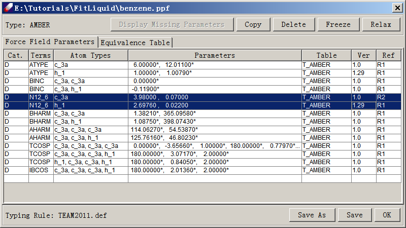
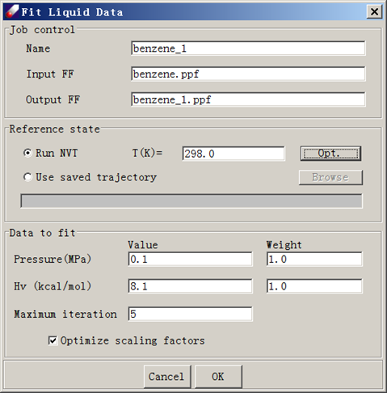

# Fitting Liquid Data

In this lesson, we will learn how to optimize VDW parameters by fitting liquid properties using liquid benzene. We will check out the parameters from a force field of TEAMFF, fit the L-J parameters using simulation data of the liquid.

Because the NVT simulation is more stable than NPT simulation, we use NVT simulation to calculate pressure (P) and heat of vaporization (Hv) as the target properties to fit, and the temperature and density are fixed as input.

In this tutorial, we use the experimental data of one temperature (298 K), there are only two target data to fit, therefore we must reduce the adjustable parameters. After all valence and charge parameters are fixed, there are still have 4 adjustable parameters. Therefore, we choose to use two scaling factors for LJ well-depth and radium respectively, to optimize. 

# Preparing a Liquid Model

An equilibrated liquid simulation box has been prepared and is included in the tutorial directory. You can skip this section. 

1.	Sketch a benzene molecule as illustrated in Tutorial 1. Check out force field parameters using **TEAMFF/Check out**. This will generate a force field in the Project Navigator. We are using the "AMBER-Basic" force field as an example.

2.	Assign charge groups for benzene molecule using **Build/Charge Group**. The charge groups, atom types, and associated force fields for this model will be carried over when building the liquid box. 

3.	Select **Build/Bulk Liquid** to build a liquid box. Select the molecular model from the pull-down menu and enter "100" as the Count. This will update several variables in the dialog window. Enter a Density of "0.872" and leave the Compress Rate as given. Click Execute to launch a background job.

4.	When the job is finished, a liquid box with periodic boundary condition will be created. Optimize the constructed liquid cell by using **Simulation/Optimization**. A few dozen steps (~60) should be sufficient. Use Nonbond Energy to set nonbond calculation options. Select Group Cutoff, set the Cutoff value to "9.5", and make sure "Tail corrections" is checked. Close the "Nonbond Energy" dialog by clicking **OK**. Launch the optimization job. The total energy should decrease rapidly. 

5.	Equilibrate the liquid model by running MD simulations repeatedly. Consider using high temperatures (~3000 K) with NVT MD simulations, and then gradually cool the system down to 298K over several (2~3) steps. Each step requires a run time of ~10 ps. Finally, run a NVT MD simulation with a 9.5 Å cutoff for 50-100 ps to equilibrate the system. 

## Optimizing LJ Parameters

To fit the L-J parameters, we use experimental data for the density and heat of vaporization for liquid benzene:
```
Temperature = 298 K
Density = 0.872 g/ml
Pressure = 0.1 MPa
Hv = 8.1 kcal/mol 
```
1.	Load the equilibrated liquid model. Make sure that the force field is associated with the liquid model. The L-J parameters must be relaxed. 
 
 

2.	Open **Parameter/Fit Liquid Properties**. Select Run NVT. Enter 298.0 as the temperature T (K), 0.1 as the Pressure (MPa), and 20.1 as the heat of vaporization Hv (kcal/mol). Click Opt to set simulation conditions. By default, the following values are given: 1 fs for Time step, 10,000 steps for equilibration and 20,000 steps for evaluation. The simulation trajectory must be saved and the default interval is every 20 steps. Make sure nonbond options are set as before. In this case, a group-based method with a cutoff value of 9.5 A and tail correction is adequate. Leave other options as illustrated in the following figure and click **OK** to launch a job.

 

If you did not select Screen View in the NVT simulation control panel (activated by clicking Opt in the Fit Liquid Data window), the job will run in background. You can now close the Direct force field interface. However, if you are running DFF on Windows platforms, a command prompt window will remain on the screen. 

3.	When the job is finished, examine the results in the output file (\<jobname\>.dfo). At the end of the output file, a section of summary of the fitting merit is given.

4.	Repeat the calculation until calculated values or parameters are converged. Note that convergence is subject to the statistic fluctuations. In a system of about 1000 atoms, evaluated pressures are normally associated with uncertainties of several thousand bars (hundreds of MPa). Normally, values within 10-20 MPa of the experimental value are considered acceptable. (With this magnitude of deviation, the percentage errors in densities obtained using NPT simulations are normally within 1%.)  

*After the parameterization, validation should be carried out to test the parameters. For example, calculating densities at different temperatures using NPT simulations with LAMMPS are usually a good test of the parameters obtained.* 

