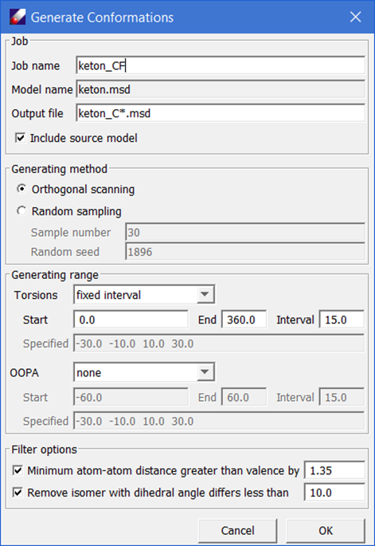
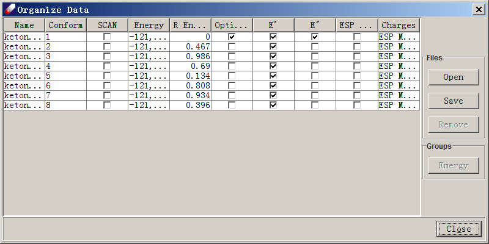
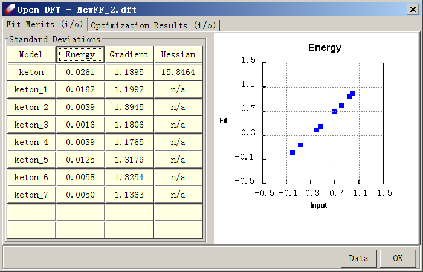
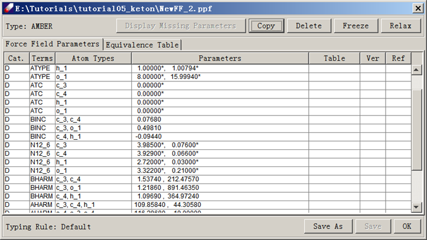

# TUTORIAL B1 - FITTING PARAMETERS FOR A SMALL MOLECULE

In this tutorial, we will learn how to use DFF to fit force field parameters for a small molecule. The molecule is dimethyl ketone in which the four heavy atoms (3 carbons and 1 oxygen) form a rigid plane with two methyl groups and are rotatable. To fit this kind of molecule is not difficult. We will learn how to make a force field that not only fits minimum energy structure, but also reproduces the conformational energy profile calculated using QM methods.

A general procedure is to obtain the QMD for an energy minimum structure as well as conformational isomers. The QMD includes energy, energy first and second order derivatives. We then fit QMD to derive valence and charge parameters.

For convenience, files used in this tutorial have been pre-calculated and provided in the TutorialB1_fitKetone folder of the tutorials project. 

## PREPARING THE QUANTUM MECHANICS DATA
1.	Start DFF and open project "Tutorials" if it is not yet. Open “TutorialB1_fitKetone” folder. Double-click on the “ketone” model and click **QM Data / Compute** command. The name of the selected model is listed in the dialog. Set the Computation to "OPT FREQ" to optimize the structure and get the Hessians in one step. The computation options as follows:
```Method: B3LYP 
Basic Set: 6-31G*
Total Charge: 0
Multiplicity: 1
CPU time limit: 300 (default) 
Memory Limit: 800 (default)
```

2. If you have GAUSSIAN software installed locally, select "Run background job" to run the calculations from DFF. When the job is done, there will be a notice prompting the next step.  To run the job outside of DFF environment, select “Make input files only”. Click “OK” to continue.

3.	When the Gaussian job is done, locate the output file (keton.gauout) in Project Navigator, right-click and select “Create QMD” to make a QMD (keton.qmd) file. A check mark of the QMD file icon ( ) indicates that this QMD data contains optimized structure with the first and second derivatives calculated. Open the QMD file will show the same information.

3.	Point to the QMD file, right-click to select “Create MSD” command, the optimized structure is saved in a new MSD (keton.msd) file. This is the optimized structure, will be used to generate conformers. Select the MSD file from the Project Navigator, click **QM Data/Conformer**, which brings up the "Generate Conformations" dialog box.
 



*Note: This dialog launches the automatic conformation generator (ACG). The software selects all dihedral angles defined by heavy atoms in the molecule, and then starts from the original structure, which should be the one of minimum energy, then scan each of the dihedral angles either systematically or randomly. *

4.	Using the default options, click OK should generate 8 isomers in a sub-folder. Select all the conformers generated and click **QM Data / Compute**. The selected conformers should be listed in the "Models to Be Calculated" text field. Set the Computation options to "GRADIENT", keep other options unchanged, and click OK to run. 

Since the isomers are not energy minimized, it is not helpful to calculate the second derivatives, but the energy and gradients are useful for fitting force field parameters.

5.	When the jobs are done, double click on the QMD file obtained above (keton.qmd) to open the QMD spreadsheet. Click the **Add** button to locate and load the newly obtained Gaussian output files. The spreadsheet will show entries loaded. Select all entries, and click **Energy** button to calculate the relative energies, some entries may have the same relative energy. You may select and delete the redundant isomer that has no second derivate. The final QMD list should look like the following figure. 



 
6. Refresh the “tutorialB1_ketone” folder and select the prepared QMD file. Create a new force field using **Force field/New force field** command. Enter "keton" as the new force field name and select “AMBER” as the force field type. Select "Default" typing rules. Make sure "Generate EQT table" is checked. Click **OK**. Examine keton.ppf tables. Note that atom types are added into the parameter table and a default equivalence table is created. 

7. Make sure "ketone.qmd" is selected, click **Parameter/Fit Charges** command. Select “ESP” as "Data Source", make sure the “Bond type based” is checked, and click Execute. The charge parameters are calculated and assigned to the 
model. 

9. Select **Parameter/Fit Energy Data** to fit valence parameters. The QMD model should be listed in the "Data to fit" box. Leave everything as default and click OK. When the job is finished, several files will be loaded into the Project Navigator. These files are the input (.dfi), output (.dfo), result force field (.ppf) and fit result table (.dft) files. The result file shows fit merits and validation results, which are structural and vibrational frequency data calculated by the force field using comparisons to QM data.  
 


The parameters can be viewed by double-clicking on the PPF file. This dialog shows two panels, “force field Parameters” and Equivalence Table. At the upper left corner, the force field type is indicated to be AMBER. At the lower left corner, the typing rule for this force field is shown as “Default”. This information is also displayed in the toolbar of the DFF interface.
 
