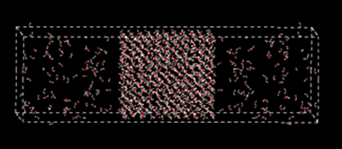

# Build a Liquid Model

Liquid models are useful for the purposes of parameterization and validation of nonbond parameters. In this lesson we show how to build pure liquid model and a liquid interface model.

## Build a Liquid Model

1. Start DFF. If the project is not fully loaded, right-click on the “Tutorials” node in Project Navigator, right-click mouse to select **Refresh** to update the list. The command **Sort** can be used to arrange the sub-folders. 

2. In the “Tutorials” folder, there is a “tutorial2_liquid” subfolder. There are several molecular models: “water”, “phenol”, “octane”, and “SOS” (Sodium octyl sulfate), which can be used to build liquid models. 

3. Let's make a mixture of water and phenol. Select water and phenol from the Project Navigator, and then open **Build/Bulk Liquid** command.  This brings up a dialog to build a liquid model. select “300” water molecules and “100” phenol molecules, set density to be “0.8”, and click Execute.

*DFF will now build a box with low density and then compress the box to the target density. The compression is a series of quick NPT simulation without sufficient relaxation. For bulky molecules, this could cause a very high energy configuration in the end. To avoid such problem, try to make an initial configuration with low density and gradually compress the box by using normal NPT MD simulations with high pressure.*

3. Select the newly built model, Click **TEAMFF/Admin** to make sure the database “TEAMFF.dffdb” is selected, set "Force Field Type" to “TEAM”, and select “TEAM-General” force field from the list. Click **OK** to close the dialog.

4. Select **TEAMFF/Assign** command to open a dialog. Rename the "Output" force field to “team.ppf”. The liquid model is listed under “Available Models”. Click **OK** to assign force field parameters for the model. 

5. When the job is complete, a force field table appears on the screen. Examine the parameters and close the force field table. Note that the models is associated with the newly obtained force field “team.ppf”, which can be verified by clicking on the model in the Project Navigator to open the Force Field Editor.  

6. The model is now ready for simulation. Open **Simulation/Molecular Dynamics** command. The options for nonbond computation can be selected by using the **Nonbond Energy** button. The group-based cutoff is recommended. If the energy of initial configuration is too high, MD simulation will stop and return an error message. Reduce the time step to smaller value (such as 0.1 - 0.001 fs) can quickly reduce the tensions in the system, then continue the simulation with normal time step.  

 
## Liquid-vapor Interface

1.	Open the **Bilayer Interface** command dialog. Enter a “Job Name” if desired, and then make sure the box dimensions in X and Y are acceptable, make the values larger or smaller will change the box sizes. 

2.	The “Phase A” is the central part of the model to be built, which has two surfaces. We will treat it as water bulk. Select “water” from the pulldown, enter “1.0” as the “Density”, and “500” as the “Count” of molecules. Note the count will change the Z-length, make sure the value is reasonable. 

3.	The “Phase B” defines the two phases above and below the central part. Let’s treat it as water vapor. Set “Density” to be “0.1”, “Count” to be “50”, so that the Z-length is like that of the bulk liquid. 

4.	Do not select anything for the “Interface”, and then click OK button to start the builder job. 

5.	When the job is finished, a bilayer model is built. Turn it around you can see the model looks like this: 

6.	Use **Simulation/Molecular Dynamics** to relax the system, and then use **Simulation/LAMMPS** to submit a simulation job. 

The vapor-liquid interface model can be used to calculate vapor-liquid equilibrium directly by using MD simulations. It is generally an expensive simulation because of slow convergence, especially at low temperatures when the number of molecules in the vapor phase is low. 

BUILDING LIQUID-SURFACTANT-LIQUID INTERFACE
DFF can be used to build liquid-liquid interfaces with or without the third molecule in the interface. We will use water, octane, and SOS to build an interface with surfactant. 
1.	Follow the same procedure as above, set “water” in Phase A, and “octant” in Phase B. The density of water is 1.0, the density of octant is 0.7. Control the “Count” so that the Z-lengths are reasonable. 
2.	Select “SOS” as the interface. Enter “25” as the number of molecules, which defines the surface concentration. The Dialog looks like this:
  
3.	Click OK to launch a series of DFF background jobs. When the jobs are finished, a new model is loaded automatically. Rotate the model, it should look like:
 

6. Select a model in the Project Navigator and then select the Build → Charge Group command to set the charge groups.  Leave the default option unchanged, click Execute to assign charge groups. The central panel of the dialog shows the charge group properties. Repeat this operation for each of models listed in the Project Navigator. Water contains one charge group, phenol has 6, octane has 10, and surfactant has 8, among these groups two are charged species: sodium cation and SO4- anion.

