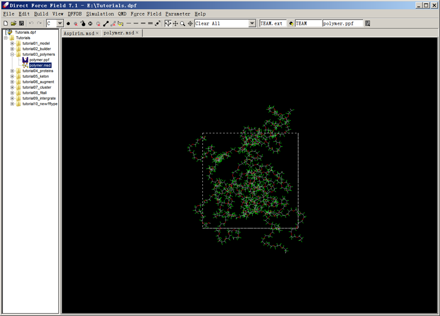
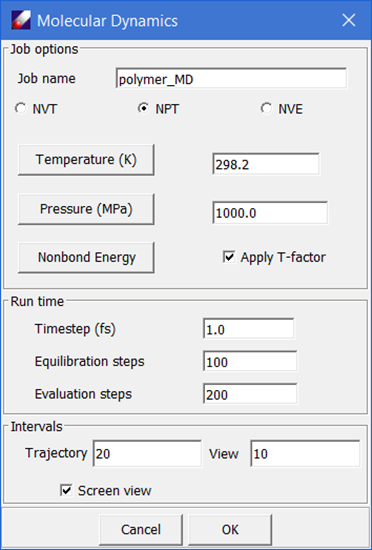
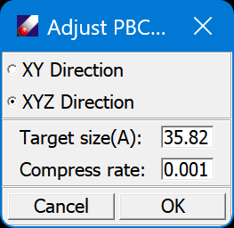
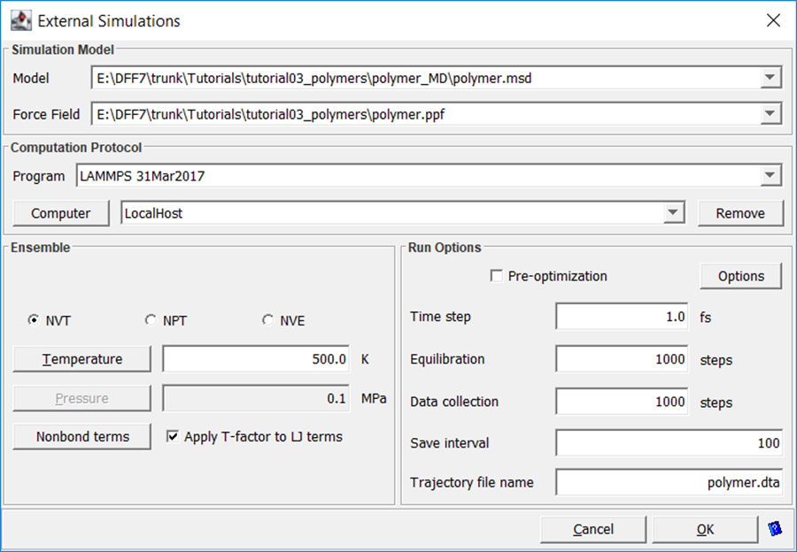
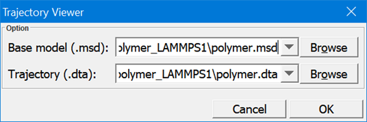
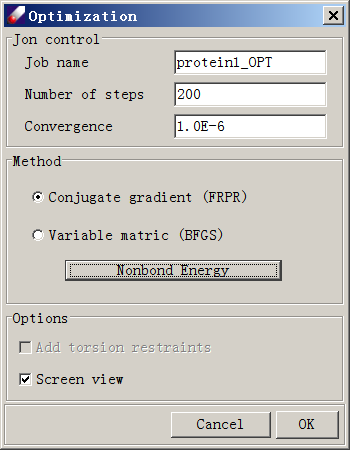
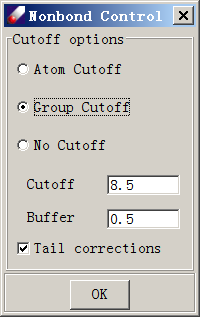

# Use TEAMFF with Macromolecules

In this lesson, we will work with a polymer model.

1. Start DFF and use **File/Recent Project** to open the tutorials project. Navigate to the project root folder, right-click, and select Refresh. This will reload all files in this project.

2. In the subfolder tutorialA3_Polymers, there is a polymer mode that has been prebuilt and converted to the MSD format. Double-click on this model to load the structure:

Note that this model has a low density (0.4587), which can be displayed by clicking “Property” in the toolbar. We will compress this model to a density closer to the experimental value.
3. Open TEAMFF → Assign command. This dialog lists the database and forcefield selected (TEAM-General). The "Output" field lists the file name to be used for the output forcefield. Unselect Click OK to assign forcefield parameters. When the job is done, a forcefield table appears. Review and close the forcefield table.
4. Select this model, open Build → Charge Group to assign charge groups, and click Go to assign the charge groups automatically. After the job is completed, the central section shows 505 charge groups (scroll the display area to the top to view). The largest group contains 7 atoms, the smallest group contains 3 atoms, and all groups have a total charge of zero charge.
5. We will now compress this model to a higher density state. Select the model and open Simulation → Molecular Dynamics. Select “NPT”, set “Pressure” to be “1000.0” MPa (very high for a rapid compression), set the “Equilibration steps” to be “100” and “Evaluation steps” to be “200”. Make sure “Screen View” is “On” and click OK.

6. DFF now displays density changes during compression. Step 5 can be repeated as needed. Every time a new MD job starts, a subfolder is created for that job. When the system approaches the targeted density (1.5), stop the job. The instantaneous configuration should approximate but not match the target density. To make an exact density of 1.5, we would need to reset the cell edge parameters. The required edge size X1 can be calculated from current edge size X0, current density D0 and target density D1 using the following equation:

$$
X_1 = X_0 + \sqrt[3]{\frac{D_0}{D_1}}
$$

For this system, the target edge size should be 35.82 for a density of 1.5. Select the model, open Edit → Adjust PBC, enter the cell edge size, and click OK. 

RUNNING LAMMPS
7. The model is now ready for simulation. Repeat a NVT simulation in DFF to relax the simulation box and verify that the density is indeed correct, and then submit the MD simulation to LAMMPS by selecting the prepared model and clicking Simulation → LAMMPS. 

The model and forcefield files are loaded automatically. Note that the option of “Apply T-factor to LJ terms” is selected, a new forcefield in which the LJ parameters are scaled according to the applied temperature will be made and used for this job. Select “NVT”, set “Steps” to “1,000” in order to see the results quickly, and note that the “Trajectory file name” is “polymer.dta”. Click OK.
8. When the job is finished, a subfolder named as “polymer_LAMMPS” will be created in the Project Navigator. This folder contains the input and output files of this LAMMPS job. Examine the input and output files. Select “polymer.dta” and “polymer.msd” files from the Project Navigator, then click Simulation → Trajectory Viewer to bring up the following dialog box:

Click OK to start a new window that replays the trajectory. The trajectory is played in a new window, you can use the same viewing options of DFF to translate, rotate, and zoom the models on the trajectory window.

## WORKING WITH PROTEINS

Models built using external software may need to be modified before assigning a forcefield. In this lesson, we will work on one example. In “tutorialsA4_Proteins”, a MOL2 file is provided. The model does not have hydrogen atoms, so we will assign hydrogen atoms first.
IMPORT MODELS AND ASSIGN FORCEFIELD
1. Start DFF and open the “tutorials” project. Right-click on “tutorialA4_Protein” and select Add → Models command. In the "Open" dialog, set "Files of type" to “MOL2 Files (*.mol2)” and select “protein1.mol2”. Click Open to load both models. 
2. In the Project Tree, click the newly added model to view it in the main screen. The model does not have hydrogen atoms. Click Add Hydrogen button (  ) on the tool bar or use Edit → Add Hydrogen to add hydrogen atoms automatically. 
3. Click TEAMFF → Admin command. Select the “AMBER” forcefield type and the “AMBER-General” forcefield.  Select protein1 and click TEAMFF → Assign. Note that the selected forcefield, model (protein1), and output forcefield are listed. Click OK to assign forcefield parameters. When the job is complete, a forcefield table appears indicating the forcefield type is AMBER and the typing rule is “Composed”, which means atom types have been successfully assigned.
PREPARE THE MODEL
5. Select “Protein1.msd” from the Project Navigator and click Build → Charge Group. Set “Allow charge crossing a bond” parameter to “0.1” and click Execute. The text area shows the results indicating the largest group has 7 atoms.
To define small charge group is essential. The groups do not have to be charge neutral, but the size may be an issue. For example, if the group is too large, GROMACS may fails. 
6. Because hydrogen atoms were automatically added, the structure is not relaxed. If the configuration is submitted to GROMACS or LAMMPS, the simulation may fail. Therefore, we should relax this configuration first. To do so, select “Protein1.msd” and open Simulation → Optimization:

Click on “Nonbond Energy”, which opens the following dialog:

Select “Group Cutoff” and leave other options unchanged. Click OK to close this dialog. Click OK again in the “Optimization” dialog and watch as the energy value drops. When the job is done, the optimized model will be saved to a subfolder named “protein1_OPT”.

## RUN GROMACS
7. Now that the optimization job is done, we are ready to submit a job to GROMACS. Click “protein1.msd” from the “protein1_OPT” folder. Make sure the forcefield is still associated and select Simulation → GROMACS command.
8. Using the default options, set the simulation steps to small numbers (e.g. 1000 steps), and click OK to start the job. The trajectory file will be saved as “protein1.dta”. 
9. When the job is complete, a notice will pop up and a subfolder named “protein1_GROMACS” will be placed under the folder in which the job is started. Double-click on the files in this subfolder to see the results of the simulation. Open the “protein1_GROMACS” folder, right-click select Import, set the file type to “GROMACS Trajectory File”, and select “protein1.dta” to load the trajectory file into protein1.dta.
10. Select “protein1.msd” and protein1.dta, then click Simulation → Trajectory Viewer to watch the trajectory. 

