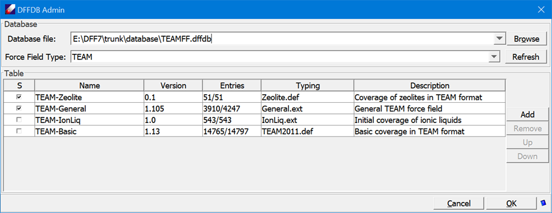
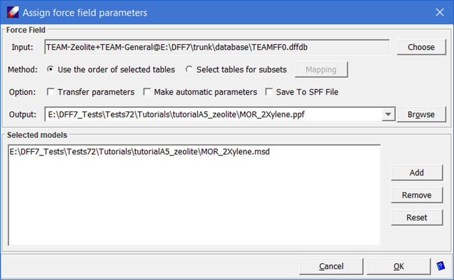
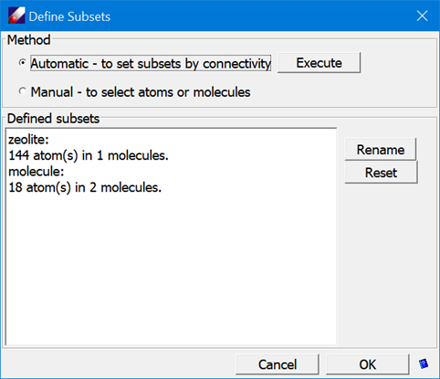
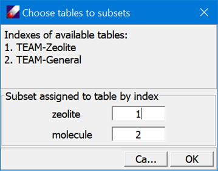

# Use Multiple Force Fields of TEAMFF

In this tutorial, we will practice how to use two force fields in TEAMFF for one simulation. This example demonstrates one of the unique features of TEAMFF: because each force field is independently developed, the force fields can be parameterized accurately. Upon use, different force fields can be applied to different molecules. Interactions between the different molecules are described by nonbond energy terms only, for which the common combination rules are applied.

In this lesson, we will use a model consisting of zeolite (MOR) interacting with two xylene molecules as an example. For convenience, a sample file “MOR_2Xylene.msd” is provided.

There are two ways to use multiple force fields, the simplest way is set the order of force field in TEAMFF so that the force fields are used in the order as specified. In order to get the best coverage, the more specific a force field is, the higher priority it should be called. Another method is more precise, define subsets of a model and use different force fields for different subsets. 

We will first use the order method, and then the subset method 

## Using the Order of Force Filed Tables

1. Enter “tutorials/tutorialA4_mixFF” folder, open “MOR_2Xylene.msd”, which is a unit cell containing two xylene molecules in cage of MOR zeolite is listed. 

2. Click **TEAMFF/Admin**, load “TEAMFF.TEAMFF”, select TEAM as the force field type, and select two force fields, “TEAM-General” and “TEAM-Zeolite”, which is indicated by the check mark in the first column. Since we will use the order to get parameters, make sure the more specific force field, TEAM-Zeolite, is on top of TEAM-General. To adjust the order, select a row and use the buttons **Up** and **Down** to adjust its position.

 

3. With the force fields are selected, click **TEAMFF/Assign**. Make sure the “Use the order of selected tables” is selected, leave other options as given, and then click OK to launch the job. A new force field will be generated and assigned to the model. 
 
 

4. To verify the force field is set properly. Use **Simulation/LAMMPS** command to launch a short MD simulation. When the job is done, using **Simulation/Trajectory** to see the simulation trajectory or examining LAMMPS output file to verify the simulation is carried out successfully.

*Note: DFF does not support simulations of crystals.*  

## Using the Subset Method

There are several ways to define subsets. The default, to define subsets by molecules, is ideal for using multiple force fields.

1. Click **Build/Subsets**. In the pop-up dialog, select the “Automatic – to set subsets using connectivity” option and click **Execute**. This will create two subsets based on the connectivity – one for the zeolite and another for the xylene molecules. 
 
 

2. Click **Rename** to rename the subsets to "zeolite" and "molecule" respectively. Close both dialogs.

 

3. Click **TEAMFF/Assign**. In the “Assign force field parameters” dialog, select “Select table for subset” and click **Mapping** to open another dialog to choose force field tables for the subsets as shown below:

 

Click OK to close the dialogs. Leave other options in “Assign force field parameters” dialog unchanged, and then click **Ok** to begin the assignment process. When the job is completed, a force field will be loaded showing parameters taken from two tables.

4. To verify the force field has been set properly. Use **Simulation/LAMMPS** command to launch a short MD simulation. When the job is done, using **Simulation/Trajectory** to see the simulation trajectory or examining LAMMPS output file to verify the simulation is carried out successfully.
 
