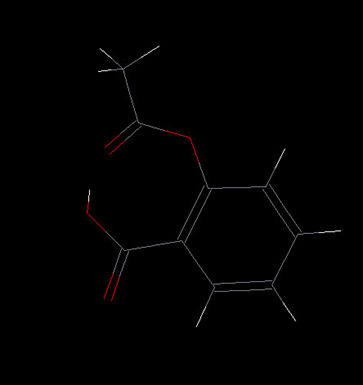
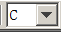
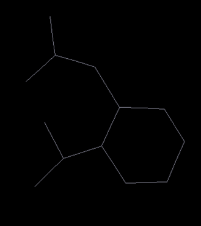
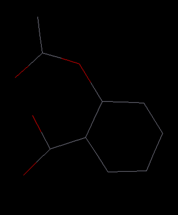
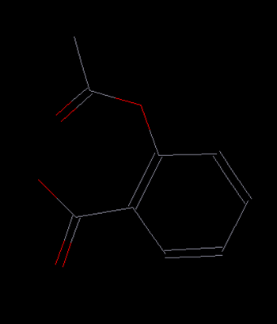
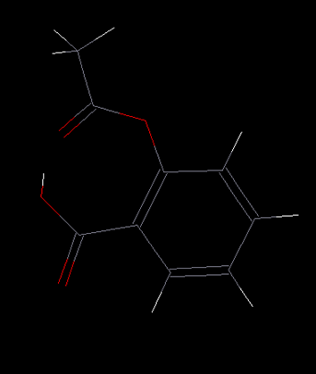

# Project and Models

In this lesson, we will show some of the basic functionalities of DFF:
- Create and manage a project
- Build a molecule from scratch
- Mouse functions for editing and viewing 

## Project
In DFF, a project is a folder that contains files and sub-folders. A project file named as ".dpf" is saved in the folder. A project can be created from scratch or by opening an existing folder. 

### Open a Project
To open a folder as project, start DFF and  **File/Open Project** command. A "Open" dialog lets you browse and select the folder to be opened. Assume you have copied the tutorials folder from "\<dff-root>/Tutorials" to "\<TestDFF>/Tutorials", then browse to find the folder and open it as the tutorials project.

The first time a folder is opened as a project, an information window will pop up. If proceed, the folder will be set as a project and a project file .dpf will be created. 

Point to the new project folder, right-click mouse button, a pulldown command list shows several commands can be applied to the project folder. Click **Refresh** to see the DFF files. 

### Adjust Font Sizes 
To adjust the font size of the Project Navigator, Point to the project file node in the Project Navigator and right-click the mouse, a pop-up options of “Larger Font” and “Smaller Font”, which can be used to change the font size.

### Create an Empty Project
Start DFF and click **File** / **New Project** command. A dialog named "Create Project" lets you browse a folder on your computer, select a folder and append a new folder name to create a new project folder.

To make a subfolder, - Hover over the new project node and right-click, a pulldown menu will pop up. Select **New/Folder** command, enter a name for the subfolder, and execute the command. A subfolder will be added and listed in the Project Navigator. You can see the project folders and files by using the **Open in Explore** command in the pulldown menu.

### Save, Close and Open Project
At any time, you can save the project by using File → Save Project command, you can also save the project into different name by using File → Save Project As command. To close the project, use File → Close Project command. DFF will prompt you to save before close. The saved project can be reloaded by using File → Open Project command.

## Create a Model

In DFF, a model is a molecular system for simulation, which can be a single molecule or a collection of molecules, with or without periodic condition. Single molecules are used for parameterization as they may be a fragment of larger molecules. In this tutorial, we will use aspirin molecule as example to show how to build a molecule from scratch. 

The editing commands are provided in the Toolbar in DFF main window for easy access. We will use these commands together with mouse actions to build a model.

1. Add a new model in Project Navigator can be done by right-clicking on the project folder, select **New/Model** command, and enter a name for the model. 

2. Select an element as “C” in the element pulldown  and then click the **Add Atom** button () to activate it. Now move your mouse to the main screen, left-click to add an atom. Move the mouse away from the first atom and click again to make another atom. The single bond between them is automatically added.

3. Repeat until a six-member ring of carbons is formed. To close the ring, click on the starting atom.

    *Note: A single click on an existing atom toggles connectivity. A yellow dot indicates connectivity is on. When connectivity is on, any atom added will be bonded to the selected atom. If you make a mistake, use the undo or redo button  to alter the operations.*

4. Continue drawing until the entire skeleton (carbon atoms and connectivity) is sketched out. At this stage, don't worry about the hydrogen atoms, elements and bond orders.  You should have a structure that looks like this:

5. Select "O" in the pull-down element menu of the toolbar. Click the replace-atom button () in the Toolbar. Replace carbon with oxygen as needed by clicking on the atom to be replaced.  You should end up with the following structure:

6. Select the double-bond button (). Click on a bond to change the bond order as needed.  When you are done with this step, the model should look like this:

7. Click the add hydrogen button ( ) to add hydrogen atoms automatically.  Hydrogen atoms are added to match the available and existing valence numbers for each atom. Make sure the bond orders are correctly set before clicking the add hydrogen button.

8. Clean the structure by clicking the refine structure button .

9. The coordinates are adjusted from the points clicked on the screen. For convenience in viewing and operation, recenter the molecule by clicking the **Edit/Reset COM** command. The molecule will be put in the center of the screen. Select the rotate button in the command bar panel , and then hold the right mouse-button and drag to see how the model can be viewed from different angles. Other commands are translation, zoom in/out and recenter (not changing COM). 

10. Click on the Save button to save the model. DFF uses the “.msd” (Model Structure Data) extension to identify model files.

## Mouse and Short-cut Key Operations

There are more mouse and keyboard editing functions can be used to edit models.

Click the selection (arrow) button in the mini command bar panel  to activate the mouse selection function. Once it is activated, click on an atom will pick up the atom, press the left button and drag the mouse will select multiple atoms. The selected atoms can be cut, copy, and paste to the same model but different location and to a different model. The common short-cut keys are supported, the combination keys Ctrl + C, Ctrl +X and Ctrl + V are used for cutting, copy and paste respectively. In addition, Ctrl + V and Ctrl + Y are used for undo and redo, which are the same as the undo and redo buttons in the toolbar.

## Commands in Project Navigator 

In the Project Navigator, some commands can be selected by point to a node on the Project Tree and right-click mouse button. Depending on the type of node, different function can be applied. For example, make a copy of a model, rename a folder, etc. 