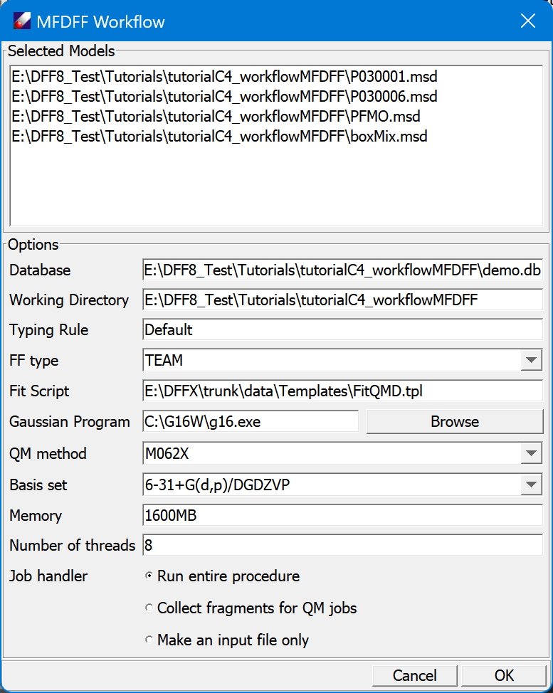

# Extend MFDFF using DFF Workflow

The MFDFF workflow is designed to build molecule type force fields automatically. In this lesson we use this functionality to make force fields for a set of molecular models included in the subfolder "tutorialC4_workflow". We will use "demo.db" database which is also included in the subfolder. Since the computation will will change the contents of the database, we will also practice operations on the database contents.

There are four molecular models saved in the folder: two short-chain polymers, one amorphous cell of polymer and one liquid model of water and phenol. To run the workflow quickly, QMD data of all fragments except water (H2O) are included in demo database.  

1. Open the subfolder "tutorialC4_workflow" of the Tutorials project. Open and view the included models. Click **MFDFF/Database** command to open the database admin dialog window, use **Browse/New** button to find the database "demo.db" in "tutorialC4_workflow" folder. View the contents of the database. There are 8 items in MolPPF and 7 items in FragQMD tables. 

2. Select all *.msd nodes "tutorialC4_workflow" folder, and click **MFDFF/Workflow** command to open a dialog as follows. Adjust the default values if necessary, especially the path to "Gaussian Program" and the "Number of thread".
By default, use **Run entire procedure** as "Job handler". 

3. Click **OK** to start a background job. The back ground job will carry out QMD computations and then construct force field for each of the molecular models. The "demo" database contains QMD files of required fragments except water molecule (identified by SMILES "O"), the job should be finished quickly. When the job is done, the dialog shows a text summery of the computation. There is also a log file saved in the working folder. The Project Navigator should be updated so that each of the models has a subfolder created in which the model and its force field are saved.
Open the database dialog again, we see both MolPPF and FragMSD tables are updated with new items of water molecule (O). 

*You may close the job dialog and leave the job running in the background.*

4. The above procedure produces force fields in one force field type (TEAM). Let's make another set of force fields in AMBER type. Repeat the procedure but select **FFType** as "AMBER". Since the QMD database has been updated with the required fragment (water), this time the job will be finished sooner. When this job is done, MolPPF is updated with a new force field.

5. Let's restore the database to original state by deleting the newly added items. Open the database dialog, select the two items identified by "O" in MolPPF, right-click to show a popup command and select **Delete**. The two items will be removed. Select the new entry of "O" in FragMSD and remove it. In addition, select and delete the sub-folders we created from *Project Navigator* to erase the newly added project files. 

6. Let's try other Job handlers. Repeat the procedure with "Collect fragments for QM jobs" option. This will add one entry "O" to the FragMSD table. Open the table, select the item and right-click mouse button, select **Compute** command to open a QM computation dialog. If we select "Make an input file only", an input file for the workflow will be generated and saved, which can be used to run the workflow from command line.  

*These options are useful if you want to use more powerful computer to run expensive jobs without using DFF interface.* 
