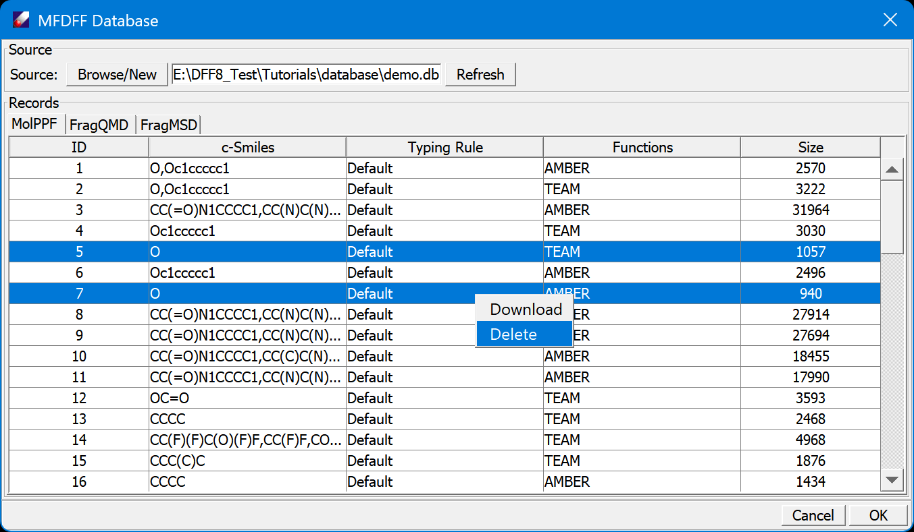

# Extend MFDFF using DFF Workflow

The MFDFF workflow is designed to build force fields automatically. For a set of target models, the workflow analyzes the models, identify constituent molecular types and fragments, and search the database for molecule type force fields. For each model, if the required molecule type force fields exist, the workflow makes an integrated force field for the model. If any molecule type force file is missing, the workflow will use its constituent fragments to parameterize a force field for the molecule type, and then save the force field in the database. 

In this lesson we exercise this functionality to make force fields for a small set of representative molecular models. The models are included in the subfolder "tutorialC4_workflow": two short-chain polymers, one amorphous cell of polymer and one liquid mixture water and phenol. We will use the "demo.db" database: `Tutorials\database\demo.db`. 

1. Open the subfolder "tutorialC4_workflow" in the Tutorials project. Open and view the included models. Click **MFDFF/Database** command to make sure the correct database is chosen. 

2. Select the *.msd files in "tutorialC4_workflow" folder, and click **MFDFF/Workflow** command to open a dialog. Adjust the default values if necessary, especially the path to "Gaussian Program" and the "Number of threads". Use **Run entire procedure** as "Job handler", and click **OK** to run. 


3. Since the database contains all molecule type force fields for the models, the process will be finished quickly, the job window should show that the models are assigned force fields successfully.

4. To test the workflow, let's remove a small molecule type and fragment, water (SMILES = 'O') from the database, and use the workflow to make a new force field. To do this, open the database again, in the MolPPF table, select entries of water (SMILES = 'O'), right-click mouse button abd select **Delete**, the entries will be removed (permanently!) from the database. Next, in the FragQMD table, delete the QMD of water. 



5. Repeat the workflow, this time it will take a little longer to finish the process. As shown in the job dialog, the workflow will compute and upload QMD of water, and then parametrize a force field for water. When the job is done, make another force field in different force field type. Since the QMD database has been updated, this time the workflow will just fit the force field, and is finished sooner. 

6. The workflow can be run as a standalone batch job presumably on high performance computers. We can use the user interface to prepare an input file for the workflow. Restart the workflow setting dialog, select "Make an input file only" option, and click **OK**. This will save an input file for the workflow. The input file can be used with workflow executable program, for example:
    
    ```$dffwfc.exe workflow.dfi &```

    assuming the path to the executable has been set. This process will make force fields for the models in the input file, and grow the collection of molecule type force fields automatically. 
    