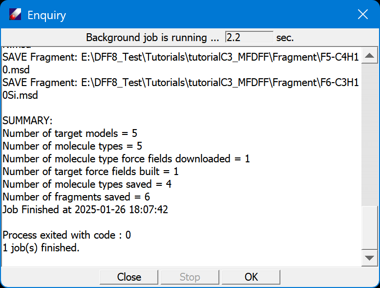

# Extend MFDFF using DFF Workflow

The MFDFF workflow is designed to build molecule type force fields automatically. In this lessen we use a few models to see how this work, which are included in subfolder "tutorialC4_workflow". We will use "demo.db" database which is also included in the folder. Since we will change the content of database, make a backup copy if you want ot repeat the lessen.

There are four models in this folder: two short-chain  polymers, one polymer in amorphous cell and one liquid model of water and phenol. To run the workflow quickly, QMD data of all except water are included in demo database.  

1. Open the subfolder "tutorialC4_workflow" of Tutorials project. Open and view the included models.
Select all *.msd nodes, and click **MFDFF/Workflow** to open a dialog:

2. The dialog is explained in [MFDFF Menu](../../WinCommands/MFDFF/MFDFF.md). Keep the default values as shown in the figure but may need to make adjustments according to your computer, such as the path to "Gaussian Program", and the "No. Process".

3. Click **OK** to open a job dialog that can be used to launch the jobs. For jobs that requires long time to accomplish, you can close the job dialog to put the jobs running is the background. You can also also save the workflow input file, and send the jobs to more powerful computer that is licensed for using DFF.

