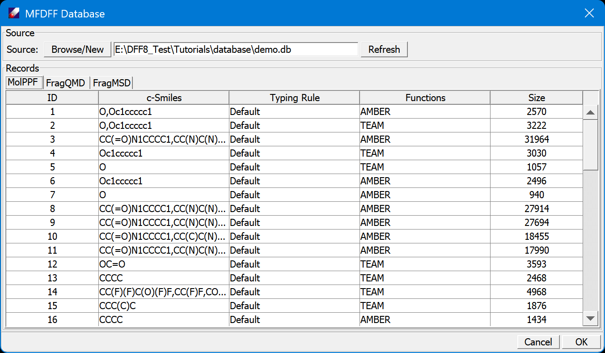
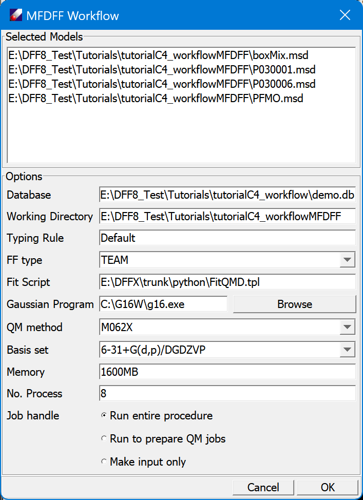

# Use MFDFF

In this lesson we practice how to use MFDFF. We will use the several polymer models, to see how MFDFF is different from TEAMFF, and the advantage of using MFDFF.

The system MFDFF database is saved as \<dff-root\>/database/MFDFF.db. For the tutorials, we will use a demo database: `Tutorials/database/demo.db`. The database file is a binary file, since we will make changes to the database, you may want to make a copy of this file before use it. Use **MFDFF/Database** command to select and open this database.

Examine the database, there are three tables, MolPPF, FragQMD and FragMSD. Click on the tab to change the view of table. Click on column head to sort the rows.  

2. Open the Tutorial project, select MSD models in "tutorialC3_useMFDFF" folder, and then run **MFDFF/Enquiry**, set the "force field type", and then click **OK** to proceed. DFF will partition the models to molecule types and search MolPPF table to see if the molecular types are covered. In this case, we will have one PFMO.msd covered, four molecule types are not, as shown in the DFF Job window.

*In this case, each model contains one molecule type, so there are five models and five molecule types. From the Project Navigator, we see one model (PFMO) has its force field built successfully, other four molecule types need to be parameterized. They are saved in /MolType folder. These molecules types are represented by six fragments, which are saved in /Fragment folder.*

3. The first step is to collect QMD for the fragments. Select the fragments in the /Fragment folder, then use **MFDFF/Collect Frag QMD" command to search and download QMD files. The `demo.db` database contains all required QMD files. Examine the downloaded QMD files.

*These QMD are pre-made using the standard procedure. You may choose not skip the computations to so that new QMD files can be computed and updated to FragQMD, which is useful if the fitting was not successful and the quality of QMD is in doubt.*

4. Since we are certain that the database contains all QMD files in need, we continue to make force fields for the molecular types. This also can be done in batch. Select all four molecule types in /MolType folder, and open **MFDFF/Build MolType PPF** command. When this job is done, we see four folders, each for one molecular type, are created. Each folder contains the fit results: .ppf, and .dft files. Open the .dft file to examine the fit and validation quality. The force fields are called fragment force fields, which are superset of molecule type force fields.

5. Now we need to assign the fragment force fields to molecular type force fields and test the stability of the molecule type force fields. This need to be done step by step: select a ppf file in one of the molecular type folder, and then click **Forcefield/Assign&Test** command, which brings up a dialog that list the relevant files and simple simulation parameters:

The molecular type .msd is filled in the dialog with the selected ppf. This dialog setup a simple MD run for a specified "Temperature", "Run steps" and "Time step (fs)". The purpose is to test if the force field is stable. Submit the job, watch the motion of molecule to see if the structure is stable. When the job is done, a new force field is named after the molecule type such as "P030016_TEAM.ppf" is saved.

Repeat this step for each of the molecular types.

6. Next, we upload the molecule type force fields to the database. Select all molecule type force fields in the home directory of this tutorial, and click **MFDFF/Update MolType PPF** command. The force fields should be added to the database. To confirm, select the target models, and repeat the **NFDFF/Enquiry** command. All five polymers are fully covered!

