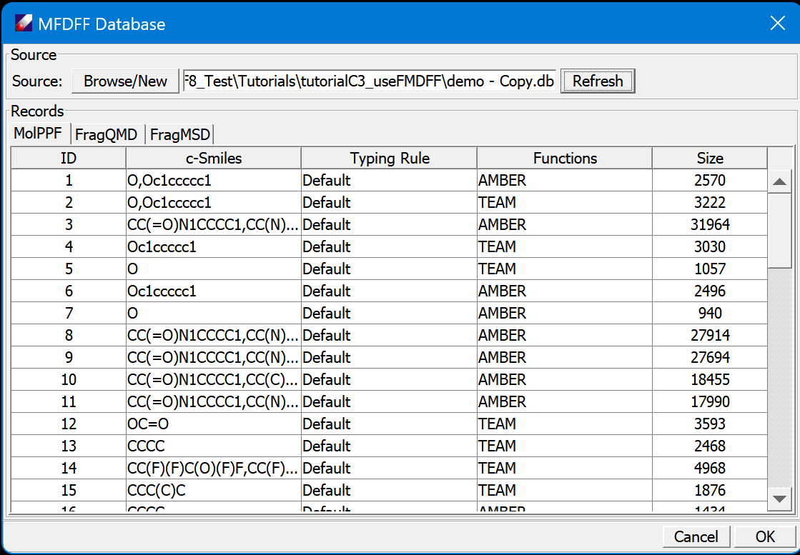
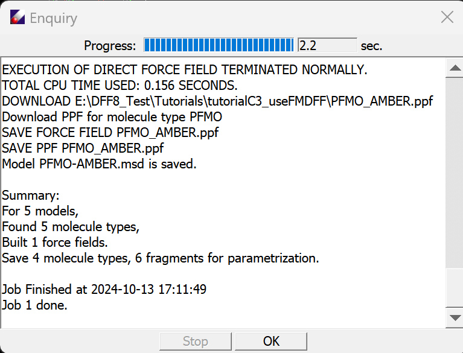
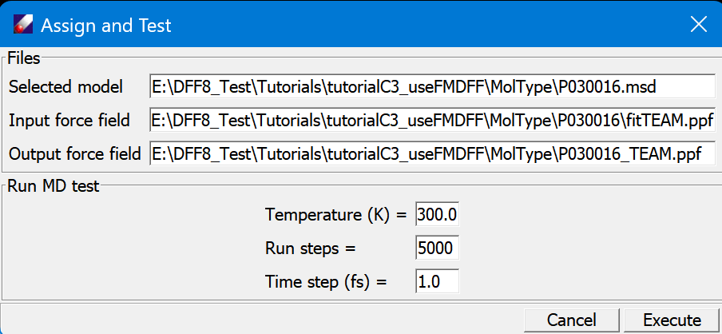
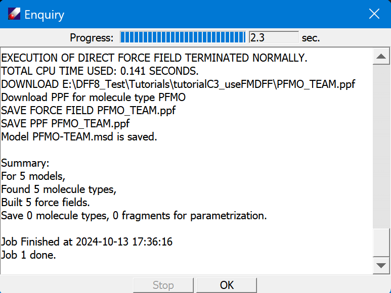

# Use MFDFF

In this lesson we practice how to use MFDFF. We will use the several polymer models, to see how MFDFF is different from TEAMFF, and the advantage of using MFDFF.

1. The MFDFF database is normally saved as \<dff\>/database/MFDFF.db. For this lesson a demo database is saved as "tutorialC3_useMFDFF/demo.db". The database file is a binary file, since we will make changes to the database, make a copy of this file from system explore and open this copy using **MFDFF/Database** command.

Examine the database, there are three tables, MolPPF, FragQMD and FragMSD.Click on the tab to change the view of table. Click on column head to sort the rows.  

2. Open the Tutorial project, select MSD models in "tutorialC3_useMFDFF" folder, and then run **MFDFF/Enquiry**, set the "force field type", and then click **OK** to proceed. DFF will partition the models to molecule types and search MolPPF table to see if the molecular types are covered. In this case, we will have one PFMO.msd covered, four molecule types are not, as shown in the DFF Job window.

 

*PFMO has force field found and assigned, the job is done for this polymer. The four molecule types correspond to other four polymers, in this case, each molecule contains one molecule type, so the molecular types share the same names and their source models. The four molecular types are saved in /MolType folder, and the six fragments are saved in /Fragment folder. Our goal is to use these models to develop force fields for the four polymers.*

3. Select the fragments in /Fragment folder, then use **MFDFF/Collect Frag QMD" command. DFF will search FragQMD table for these fragments. In this case we have six QMD files found and downloaded.

*These QMD are pre-made using the standard procedure. You may choose not skip the computations to so that new QMD files can be computed and updated to FragQMD, which is useful if the fitting was not successful and the quality of QMD is in doubt.*

4. Now let's assume the QMD files are sufficient, make force field for each molecular types. This also can be done in batch. Select all four molecule types in /MolType folder, and open **MFDFF/Build MolType PPF** command. when the job is done, we see four folders, each for one molecular type, are created. Each contains the fit results, .ppf, and .dft files. Open the .dft file to examine the fit and validation quality.

5. Now we need to assign the molecular type force field to its source polymer models and test the stability of the force field. Select a .ppf file in one of the molecular type folder, and then click **MFDFF/Assign&Test MolType PPF** command, which brings up a dialog:

The molecular type .msd is filled in the dialog with the selected .ppf. This dialog setup a simple NVE MD run for a specified "Temperature", "Run steps" and "Time step (fs)". The purpose is to test if the force field is stable.
When the job is done, DFF examine the result, if it appears to be ok,  will prompt you to upload the force field to the database. 
Repeat this step for each molecular type.

6. Select the polymer models, and repeat the **NFDFF/Enquiry** command. Now we see all five polymers are fully covered!

*This tutorial shows that a library of molecules can be built rapidly. The most expensive part is in the QMD computations.
