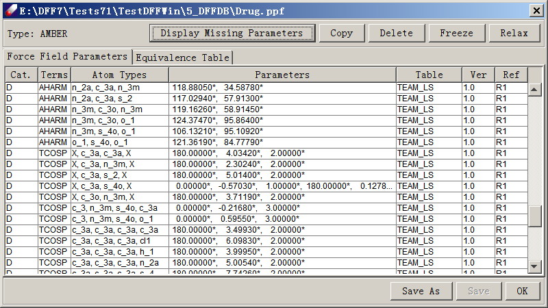
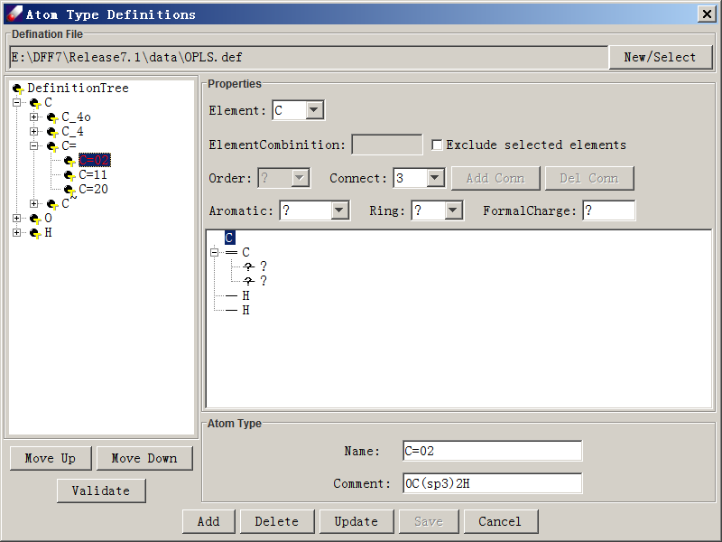

# force field MENU - MANAGING force field

These commands are used to manage force field files. In DFF, force fields are written as .ppf files.

**New Force Field** opens a dialog for creating a new force field for the selected models. By default,the force field is filled with estimated parameters, which is an option of 'Estimate parameters'.  First, select one or multiple models, which are listed in 'Selected Models', then select 'Force field type' from a pull-down menu. The 'Atom typing rule' can be set as `Default` or using a definition script (*.def or *.ext) found in the `<dff-root>/data/TypingScripts` folder. The 'Atom type equivalence' sets how the apparent atom types are mapped to equivalent atom types, which impacts the real number of atom types used in the force field. Next, enter a name for the force field, the default is `NewFF.ppf`. Click 'OK' to lunch a background job. When the job is done, the new force field should be displayed in a new dialog that shows the force field parameters. This dialog can be opened by double-clicking on a force field file in the Project Navigator.

There are three sections in the table. At the top are commands that can be performed on parameters. The middle section displays the parameter table and the optional equivalence table. The bottom portion contains commands for the force field file.
Commands that can be performed on parameters are Display Missing Parameters, Copy, Delete, Freeze and Relax. To use these commands, select one or more lines in the parameter spreadsheet and click on a button. Display Missing Parameters is activated if parameters are missing (with empty lines), and will shows atom associated with the missing terms. Copy makes copy of the selected lines and appends them to the table. Delete removes selected lines from the table. Freeze prevents parameters from being adjusted and marks them with an asterisk (*). Relax allows frozen parameters to be adjusted and removes the asterisk.
The parameter spreadsheet has six (6) columns - Table, Version, Terms, Atom Types, Parameters and Reference.  Table shows the database table from which parameters are taken. Version displays the parameter version number, and Reference indexes the reference list. These terms may be empty if a force field was not taken from a TEAM-FF database. The central three columns, Terms, Atom Types and Parameters, are essential for any force field.
Clicking on the heads of columns sorts the lines accordingly, which is helpful for finding terms. Atom Types and Parameters cells are editable. Double click on a cell to change its values. Right-clicking a line brings up three commands - Freeze force constants, Reverse to original, and Set to zero. These commands provide additional ways to control parameters, which is useful for difficult fitting tasks. 
Commands that can be performed on force field file are Save As, Save and OK to close the dialog.

**Import Force Field** converts force field files in other formats to the DFF PPF file format. It reads AMBER, CHARMM, CFF and DREIDING formats. In the Importing force field Dialog, force field type lists supported file formats. Import from lists the file location, and Browse is used to navigate to the file. When Protect imported parameters is selected,  imported parameters will be frozen. When Active parameters only is selected, only required parameters of the selected model will be imported. Save to indicates where imported parameters are saved.

**Assign Atom Type** is used to assign atom types to models using an Assign Atom Types dialog. In this dialog, four methods can be used to assign atom types: Use Default typing rules call the program to calculate atom types; Use scripted typing rules let selection of the typing scripts in the pull-down menu; Replace atom type from, in which all atoms can be switched from one type to another, and Assign type for Atom, in which atom types can be changed for a particular atom. Execute assigns atom types using the selected rules. 

**Define Typing Rules** opens an Atom Type Definitions dialog to create or modify a typing rule file.

The typing rule file (.def) must be placed in the <dff-root>/data folder.  New → Select is used to open or create a .def file. The Atom Type Definitions dialog is divided into two main regions. The definition tree on the left shows the relationships between all defined atom types. The child nodes are derived from a parent node and they are more specifically defined than their parent is. The siblings are exclusively defined so that there is no ambiguity. Clicking any node of the definition tree displays properties of selected atom type on the right side of the dialog.  
The definition tree also indicates how atom types are searched and compared. Each atom type is a node on the tree, and the order shown in the tree sets the precedence order for assigning atom types, with types at lower-order nodes taking precedence over higher-order nodes. Move Up and Move Down moves an atom type up or down at the same level. A Validate button is used to check for conflicts between the selected definition and its sub-definitions. 

An atom type definition must specify properties of the center atom and its neighboring atoms. These properties are also displayed in a small tree-structure at the right side of the Atom Type Definitions dialog.  The center atom is the root node, while neighboring atoms are subnodes. Clicking on the root node or any subnode to review its properties. The Element pull-down displays the element of selected node, which can be changed. Once an element is selected, checking Exclude selected element sets the selected element as exclusive (every element but this one). Order sets the bond order of a subnode to its super-node. For the root node, Order is grayed out. Connect indicates how many subnodes a selected node has. Add Conn or Del Conn increases or decreases available subnodes. Aromatic can be set to Yes, No or? (Unknown); Ring indicates ring number, and FormalCharge sets the formal charge. The Atom Type section lists the Name of the defined atom type, and Comment provides a description of the definition to be saved in the .def file.

After a definition is specified, Add is used to add a new type to the definition tree. Delete removes a type from the definition tree. Update applies any changes to a selected node’s attributes. Save writes the revised definitions to the .def file. Close quits the dialog without saving.
Define force field type opens a dialog to define a new force type type. In this dialog, Type Name can be any string representing the type to be defined. Functional terms can be specified using Select button, which open a Select Function Term dialog listing all available terms. There are two panels, Basic Term and Cross Term. By default, none of the checkboxes are selected. A function term can be set by clicking its checkbox and selecting a functional form from the pull-down list. After selecting terms, close the dialog to save the new type definition. You may use it by creating a new USERDEFINE-type force field. 

**Associate Force Field** assumes atom types have been assigned to the selected models and associates a force field with the models. It brings up a list of force fields available for selection in a given project, checks if parameters are complete in the selected force field, and assigns atom charges accordingly. This command is also accessible from the Project Navigator by selecting models and right-clicking. 

**Dissociate Force Field** remove the link with force field for the model selected. 

**Assign Atom Charges** assigns or recalculates atom charges using charge parameters in a selected force field. It is active only when charge parameters are available in the selected force field.
ADVANCED TOPICS ON force field
Importing an external force field to DFF involves two steps: 1) reading in parameters and writing them to a PPF file, and 2) creating typing rules for the external force field. After parameters and typing rules are prepared, the force field can be made into a new table in TEAM-FF. 

**Modify Force Field type** opens a dialog to modify user defined force field types. Modify changes the definition. Delete deletes the definition.
