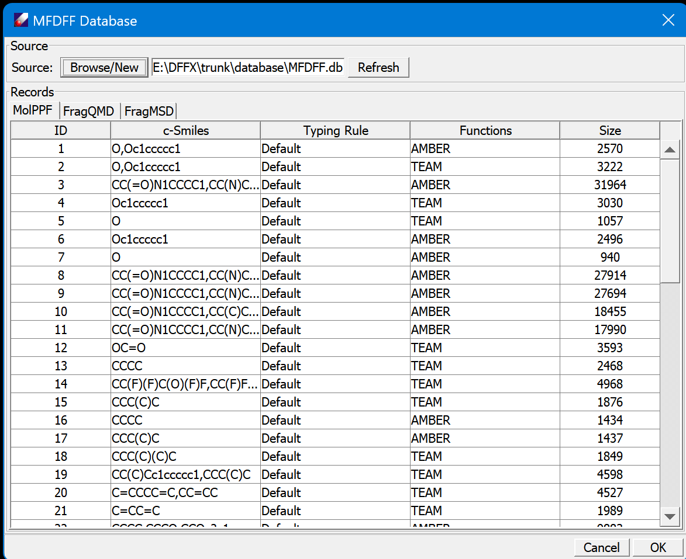
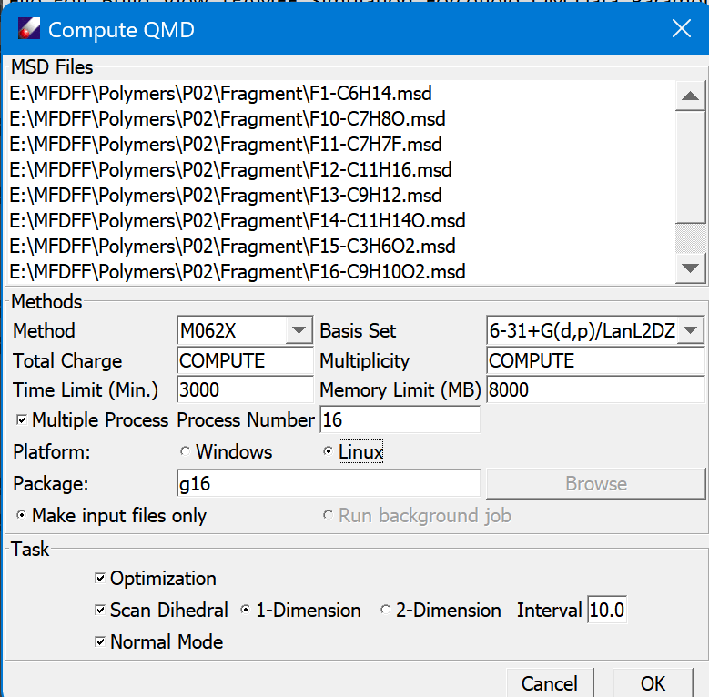
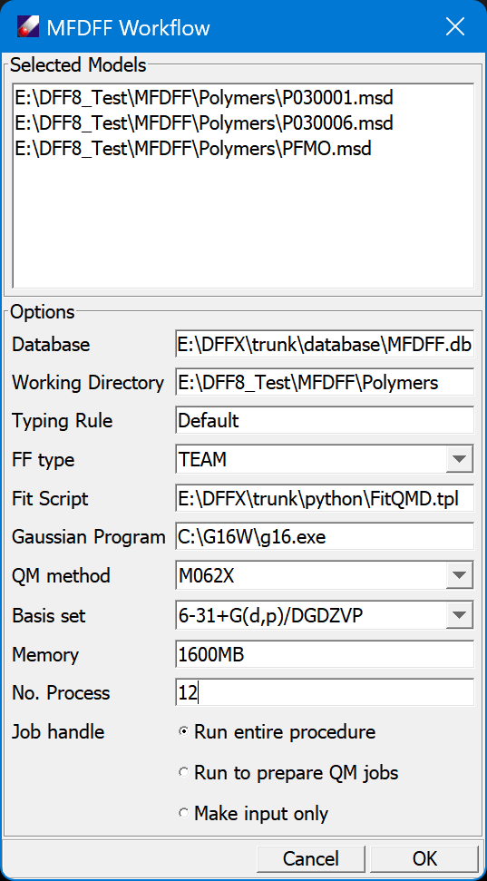

# MFDFF Menu

Molecular Fragments Described Force Field

## Database
This command opens a dialog that shows then content of MFDFF database, and provides tools for managing the database. 

The top section is used to manage the database file. The button **Browse/New** is a command to create or open a database. The database is saved as a binary file in \<dff\>/database directory. **Refresh** updates the content of the tables, which is useful if the table has been changed.

*Note: The database can be put in any place that you have access right. If you are making any changes to a database, make a backup copy either from command line or Window explorer.*

The database has three tables, MolPPF, FragQMD, and FragMSD. MolPPF is a table of molecule type force fields (MT-FFs), FragQMD stores QMD files of fragments, and FragMSD is for MSD files to be calculated. Mouse click on the tab to see the corresponding table. 

The data can be sorted by mouse-clicking on the head of column. 

In each table, select rows and right-click mouse button will open a popup command, which contains **Download**, **Delete** for all three tables, and **Compute** for FragMSD. 

**Download** will download selected entries and save them in current directory. This is useful for examining the data, and possibly compute the data and update the entries.    

**Delete** is used for removing the selected entries. Note this operation is not reversible, make sure the database is backed up before deleting any entries.

**Compute** is only used on FragMSD table. the selected entries will be collected and open a dialog to perform the QM computations.

## Enquiry Force Field 

This command applies to any molecule models, large or small. One or multiple models can be handled at once. 

Select the model(s) from Project Navigator, click on this command to open a dialog. The dialog lists the selected files to confirm. Click **Cancel** to quit. **OK** to start the computation. A new Computation window appears to show the output of the background job.  

In the background, DFF analyzes each of the models, identify molecule types in the model, and search MolFF table for molecule type force fields (MTFFs). If all required MTFFs are obtained, an integrated force field will be made for the model. If any MTFFs are missing, the corresponding molecule types and their molecular fragments will be saved in subdirectories named as "MolType" and "Fragment" respectively. The Project Navigator will be updated for the new folders and files. 

## Collect Fragment QMD

Select the fragments to be used for parametrization, click this command. DFF will search and download corresponding QMD files from the FragQMD table. Depending on the results of searching, several selection dialogs will appears. Respond to the questions to proceed. You can recompute all QMD, or skip existing ones. If new computations are requested, the corresponding MSD files will be collected, saved in the FragMSD table, and prompt in a QMD computation window.

This interface is used to set up QMD computation options. The jobs can be run within DFF on the local host computer, or saved for later or submitted to remote computers. The computation is done by using Gaussian program package, driven by DFFQMD.exe program. The **Task** section provides selection of what to be computed.

*Note: This command window can be opened by using the pull-down command on FragMSD table and the **Compute Frag QMD** command. 

## Build MolType PPF

When all required QMD files are in the database, use this command to build MT-FF for molecule types. 
For each molecule type, DFF searches and downloads required fragment QMD files, then starts regression using a default fitting and validation procedure. Watch the computation output to see the summary of regressions.  

## Assign and Test MolType PPF

This command assigns the force field obtained from regression of fragment QMD to the target molecule type, which will reduce the parameters to the target molecule only. It also runs a short MD simulation to test the stability of the result force field. If all appears to be right, prompt to update the MolPPF table.  

*Note: When the new MT-FFs have been uploaded, repeat **Enquiry** command to get the force field for the target model. 
The following commands are fro specific tasks, which can be used when the semi-automatic procedure is interrupted or failed.*

## Molecule Type

This command works on any models, it is used to find the molecular types in the models and save the result in /MolType folder.

## Standard Fragment

This works on molecular types, identify constituent fragments and save the fragments in /Fragment folder.

## Update FragQMD

This command uploads the selected QMD files to FragQMD table. If any QMD files exist in the table, identified by fragment SMILES strings, the existing ones will be overwritten. If update is done successfully, corresponding fragments saved in FragMSD table will be removed.  

## Download FragQMD

This command uses fragment MSD to search and download corresponding QMD.   

## Update MolPPF

Load PPF files for molecule types, identified as molecule type MSD files.

## Download MolPPF

Search and download PPF files for molecule types, provided as MSD files.

## Program Fit

This command provides flexible fitting options, organized as multiple tasks, each is presented by a tabbed panel. The jobs can be run sequentially or independently, so that different options can be tested and compared. 

## WorkFlow

This is an automated workflow for making force fields automatically. For a set of models, the workflow aims to get new atom types and a force field assigned to each of the model. Meanwhile, the FragQMD and MolPPF of database are updated.

This command opens a dialog to set parameters for the workflow:

The selected models are listed on the top section. 

"Database" is the database selected. Use **MFDFF/Database** command to change the database. The typing rule is fixed by the database because it determines the partitions of fragments. You may choose "FF type". The "Fit Script" is a text file used to generate fitting input. This file can be edited so that you may optimize the fitting procedure. You must set the "Gaussian program" properly. "QM Method" and "Basis set" can be changed, note the default is used for building the default database. "Memory" and "No. Process" need to be set according to your computer setup. These options imply to use the Multi-Thread Parallel (MTP) method, which means using multiple threads on one computer. The last section set how the program to run. "Run entire procedure" will do all computations inside of DFF, which may take a long time. "Run to prepare QM Jobs" will prepare the required QMD jobs, and stop. You then need to do the QM jobs externally and update the database using **MFDFF/Update FragQMD** command. "Make input only" will make an input file for the workflow, and you can execute it from command line or on another computer with DFF installed or licensed.  