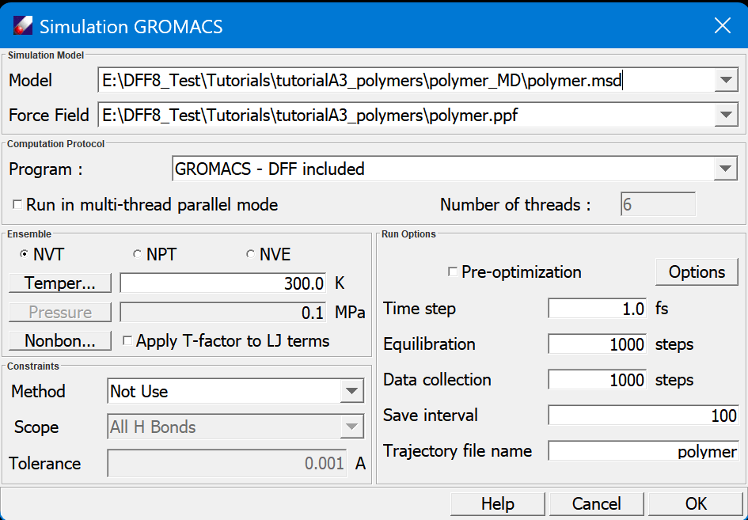

## Simulation GROMACS Dialog

- **Model** lists the molecular model file (.msd) to be used for the simulation. The model should have atom types, charges, and force field parameters assigned. 
- **Force field** indicates the force field file (.ppf) assigned to the model. 
- **Program** is used to select executable software. DFF includes a compiled code, if you system has the software installed, select "System Installed". The multi-thread parallel mode can be used.
- **Ensemble** section lists three usable ensembles, NVT, NPT and NVE. Temperature sets the simulation to run under temperature control methods, the choice of which depends on the software selected. Pressure sets the simulation to run under pressure control method. Nonbond interactions sets options for nonbond evaluations. An option of Apply T-factor to LJ term scale the nonbond parameters using temperature scaling factor. A new PPF file will be generated before the force field is exported to the simulation software. 
- **Constraints** section sets certain constraints supported by the simulation software. 
- **Run Options** specifies how the simulation is conducted. **Pre Optimization** allows the software to perform an energy minimization before MD simulations. **Time Step** specifies the integration time step in fs. **Equilibration** is the number of steps to simulate before collecting data. **Data collection** is the collecting steps for data analysis. **Save interval** and **Trajectory file** set how the trajectory file is saved. 
