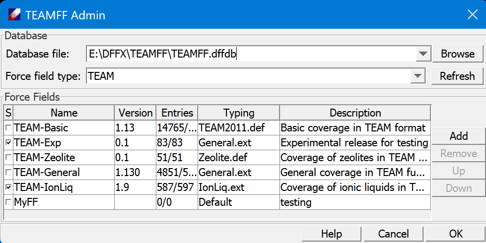
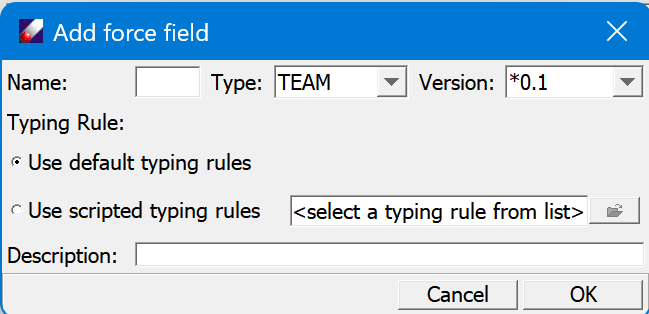

## TEAMFF Admin Dialog

This dialog shows the force fields available in TEAM force field type. 

- **Database file** lists where the database data file is located. The pulldown menu lists files opened previously. Each database is stored as a binary file with the “.dffdb” extension. The database file can be placed anywhere on your computer. 

- **Browse** can be used to locate and load a database file. The default location is the \<dff-root>\database folder.

- **Force field type** sets the scope of force fields shown. Choose a force field type by using the pull-down menu. 

- **Refresh** reloads force fields.

- **Force Fields** table lists the available force fields. Each force field can be selected by checking the checkbox. To the right of the checkbox is the Name of the table, its highest Version number, the number of unique and total Entries, its Typing Rules, and brief description of the table. The Version number can be selected using a pop-up pull-down menu that appears when the version cell is selected. This sets a specific version to be used, but does not change the table. **Show log** command can be accessed by right-clicking a table entry. 

- To the right are four commands can be applied to the force field tables. **Add** is used to add a new force field, and **Remove** can be used to remove a force field.
The **Up** and **Down** buttons are used to change the order of force fields. When the database is used, DFF reads parameters from the top of the list and moves down only when parameters are not found. To reorder the list, select a table and click **Up** or **Down**. 

- Click **Add** button opens a "Add force field " dialog as shown below. Enter a name for the force field to be created and select a force field type. The version number is an initial number, every time when new parameters are added, the version number is increased automatically. Select a typing rule, which must be the same as the force field to be developed and added. The default typing rule is recommended, only if the default is not sufficient, consider to use definition script. Finally, enter a brief description of the table and click **OK** to create a new force field table. Note that this create a empty table, the actually parameters can be added by using **Check in** command.

     