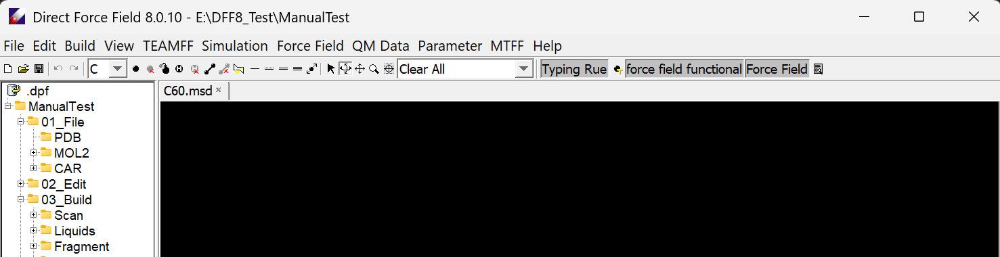

# Toolbar

The toolbar is located on the top of DFF main screen, right below the command panel and above the main screen. It provide quick commands for viewing and editing.

Each button in the toolbar is a command. They are organized by several blocks starting from the left. 

The first block is used for operations on models, create, open, and save a model.

The second block is for editing, it includes undo, redo, select element, add, delete, replace atom, add hydrogen, remove hydrogen, add bond, delete bond, relax structure, change bond orders to single, partial double, double and triple, and move atom positions. Add or remove hydrogen atoms for entire model will be executed when the button is clicked. Other commands are executed by selecting the command, and then use the mouse to select a empty space (for adding), atom or bond (for alternating) to continue.

The third block is for additional mouse functions of viewing. The arrow button is used to select one or multiple atoms, the rest are used for rotating, dragging, zooming and centralizing of the model selected. 

The forth block is a pulldown menu for labeling, various properties can be shown for atoms or molecules. 

The last block is for force field operations. Selecting typing rule and assign atom types, show and editing the selected force field (PPF).

## Mouse Operations

To add, delete, replace atoms, select an element first, and then point mouse to a empty position for adding, or an atom to delete or replace. Note the newly added atom will be highlighted, continue to add another atom will automatically build a bond between the two atoms.

Click the selection (arrow) button in the command bar panel to activate the mouse selection function. Once it is activated, click on an atom will pick up the atom. You can also press the left button and drag the mouse to select multiple atoms. You can cut, copy, and paste the selected atoms, to the same model but different location (where the mouse point is) and to a different model.

The common short-cut keys are supported, the combination keys Ctrl + C, Ctrl +X and Ctrl + V are used for cutting, copy and paste respectively. In addition, Ctrl + V and Ctrl + Y are used for undo and redo, which are the same as the undo and redo buttons in the toolbar.
