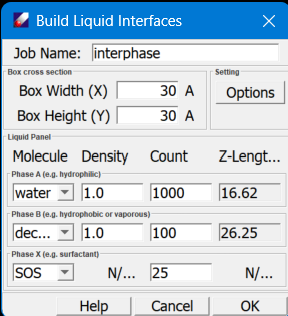

## Build Liquid Interfaces Dialog

**Job Name** sets the name of computation result files. 

**Box Width**
**Box Height** set the dimension of the cross section. 

**Options** sets the compression parameters, two steps are used: the energy minimization (MM) and molecular dynamics (MD), the default values are given. 

**Specify molecules in each phase** On the "Liquid Panel" select molecules for each phase. Phase A and B are two bulk phases, which are usually hydrophilic and hydrophobic molecules respectively. The interphase X should be a surfactant phase. Note the Z-lengths change as the numbers of molecules in phases A and B change. Teh Z-lengths of Phase X is determined by the molecular length.

**Help** shows this page

**Cancel** to quit.

**OK** to start computation. DFF will build each of the three phases first, and then pack the three phases together.

