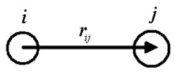
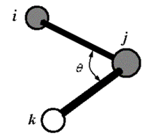
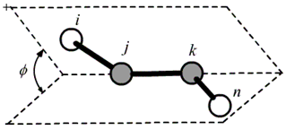

# Force Field Functions

## Bond Functions
Bond is defined by two atoms:

|ID    |Function   | Parameters | Note
|------|-----------|------------|------
|BHARM |$K_b(r_{ij}-r_{ij}^o)^2$ |$r_{ij}^o$, $K_b$ |	Harmonic
|BQUAR |$K_{b2}(r_{ij}-r_{ij}^o)^2+K_{b3}(r_{ij}-r_{ij}^o)^3 + K_{b4}(r_{ij}-r_{ij}^o )^4$ |$r_{ij}^o, K_{b2},K_{b3},K_{b4}$| Quartic expansion
|BDQUA |$K_{b2}(r_{ij}-r_{ij}^o)^2 - 2(r_{ij}^o-r_{ij}^o )^3 + \frac{7}{3}(r_{ij}-r_{ij}^o)^4$ |$r_{ij}^o, K_{b2}$| Derived quartic expansion

## Bond Angle Functions
Bond angle is defined as by three atoms i-j-k:

|ID    |Function   | Parameters | Note
|------|-----------|------------|------
|AHARM	|$K_θ(θ-θ_o)^2$   |$θ_o, K_b $| Harmonic	
|AQUAR	|$K_{a2}(θ-θ_o )^2+K_{a3}(θ-θ_o )^3 + K_{a4}(θ-θ_o )^4$|$θ_o, K_{b2},K_{b3},K_{b4}$ | Quartic expansion        
|ADQUA	|$K_{a2}(θ-θ_o)^2+ A(θ-θ_o )^3 + B(θ-θ_o )^4$|$θ_o, K_{b2}$ |Derived quartic expansion
|ACOSH	|$K_a(cosθ-cosθ_o)^2$|$θ_o, K_b$|Coosine square	

In ADQUA,  if ($\theta_0\neq0,\pi$ ), 
$A = \frac{2(\pi-2\theta_o)}{3\times \theta_o(\pi-\theta_o)}, B = -\frac{1}{2\times \theta_o(\pi-\theta_o)};$ if $\theta=0, \pi$, $A = B = 0.$

## Dihedral Angle Function

dihedral angle is defined by atom i-j-k-l, where j-k is the center bond.

|ID    |Function   | Parameters | Note
|------|-----------|------------    |------
|TBCOS |$\sum_{n=1}^6 k_n[1+cos(nφ-φ_o)]  $|$ k_φ        $| odd n: $φ_0$ = 0 ; even n: $φ_0$ = π
|TCOSM |$\sum_{n=1}^3 K_n[1-cosn(φ-φ_o)]  $|$ φ_o, k_n   $| 
|TCOSP |$\sum_{n=1}^3 K_n[1+cos(nφ-φ_o)]  $|$ φ_o, k_n   $| 
|TCS3M |$\sum_{n=1}^3 K_n(1-cosnφ)  $|$ n, k_n           $|  

## Improper Dihedral Angle Function
The improper dihedral angle is measured as the dihedral 
angle of two surfaces made by bond pairs of j-i/i-k and 
n-i/i-k respectively.

