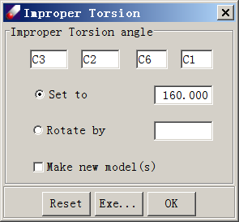

# Basic Syntax

## Paragraphs

Lorem ipsum dolor sit amet, consectetur adipiscing elit. Vivamus eu quam ante. Proin in faucibus lorem. Cras finibus finibus dui et interdum. Phasellus a metus ut lectus viverra facilisis. Mauris suscipit euismod lacinia.

Quisque nec felis id nisl posuere ullamcorper. In sit amet eros eu metus commodo tristique. Vestibulum imperdiet facilisis massa at condimentum. Nulla iaculis mattis magna sit amet hendrerit. Suspendisse potenti.

### New line without starting a new paragraph

First line (note the two empty spaces after this)  
Second line

## Links

- [External URL](https://wikipedia.org)
- [Internal page](./02-footnote.md)
- [Section on the same page](#media)
- [Section on another internal page](../online/tutorial.md#upload-and-run)
- [External Reference Style Link]

## Bold, Italic

You can stylize your text in **bold**, _italic_, **_Both both and italic_**.

## Lists

Ordered list:

1. Section 1
   1. Item 1
   1. Item 2
      1. Sub item 1
      1. Sub item 2
   1. Item 3
2. Section 2
   1. Item 1

Unordered list:

- Section A
  - Item A
  - Item B
    - Sub item A
    - Sub item B
  - Item C
- Seciont B
  - Item A

## Code, Command, Parameter, Filename

It can be either `inline`, or block:

```sh
$ java -version
openjdk version "1.8.0_201"
OpenJDK Runtime Environment (build 1.8.0_201-b09)
OpenJDK 64-Bit Server VM (build 25.201-b09, mixed mode)
```

## Media



[external reference style link]: https://wikipedia.org
